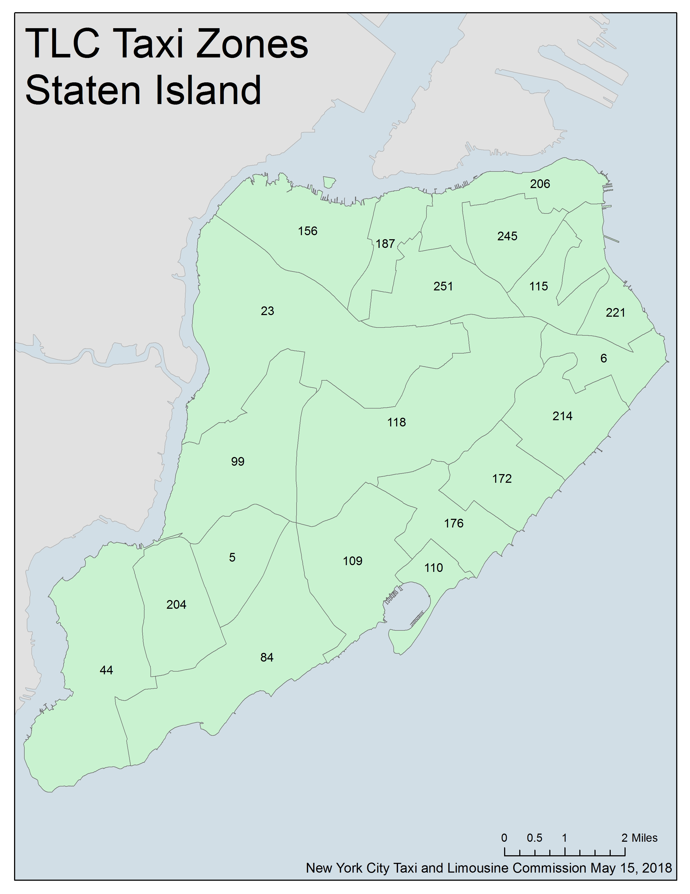
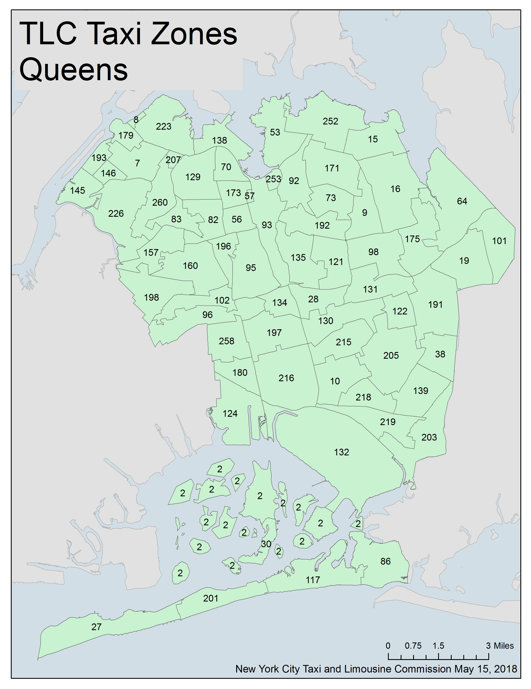
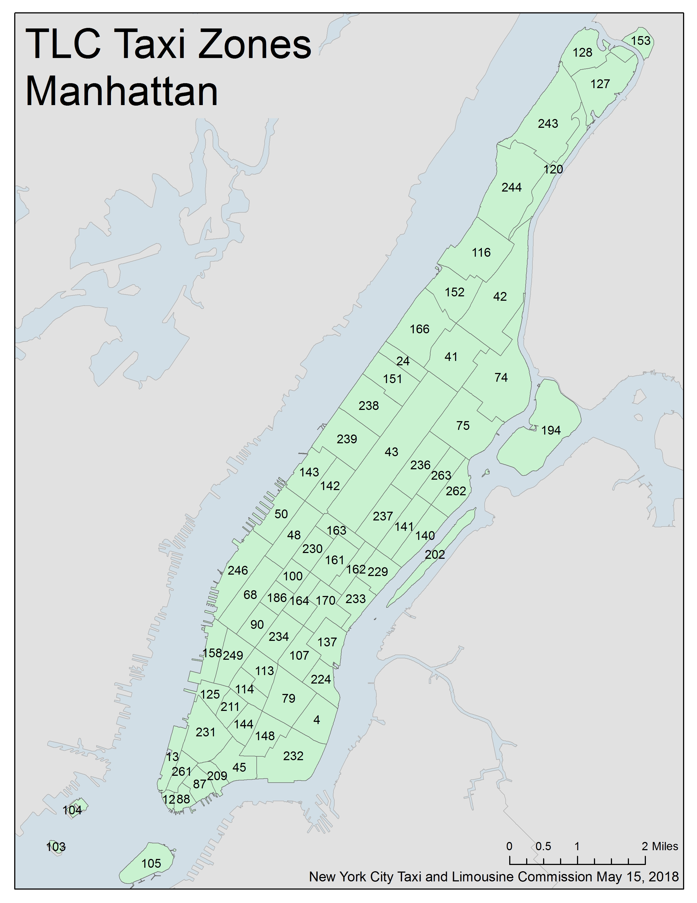

## Data Sets on Amazon S3 

1. **Yellow Taxi Trip Data** 

   * `yellow_tripdata_2023-09.parquet`

   * `yellow_tripdata_2023-10.parquet`

   * `yellow_tripdata_2023-11.parquet`
   * `yellow_tripdata_2023-12.parquet`
   * `yellow_tripdata_2024-01.parquet`
   * `yellow_tripdata_2024-02.parquet`
   * `yellow_tripdata_2024-03.parquet`
   * `yellow_tripdata_2024-04.parquet`
   * `yellow_tripdata_2024-05.parquet`
2. **Green Taxi Trip Data**

   * `green_tripdata_2023-09.parquet`
   * `green_tripdata_2023-10.parquet`
   * `green_tripdata_2023-11.parquet`
   * `green_tripdata_2023-12.parquet`
   * `green_tripdata_2024-01.parquet`
   * `green_tripdata_2024-02.parquet`
   * `green_tripdata_2024-03.parquet`
   * `green_tripdata_2024-04.parquet`
   * `green_tripdata_2024-05.parquet`
3. **High Volume For-Hire Vehicles**
   * `fhvhv_tripdata_2024-01.parquet`
   * `fhvhv_tripdata_2024-02.parquet`
   * `fhvhv_tripdata_2024-03.parquet`
   * `fhvhv_tripdata_2024-04.parquet`
   * `fhvhv_tripdata_2024-05.parquet`
4. **Lookup Table**

   * `taxi_zone_lookup.csv`

---

### Additional Data Sets to Consider (Optional)

1. **NYC Weather Data (Sep 2023 to May 2024**

   * `Weather Data NYC.xlsx` available in S3

2. https://www.nyc.gov/site/tlc/about/about-tlc.page

3. https://opendata.cityofnewyork.us

4. https://ourworldindata.org

   ****

## Metadata/Data Dictionaries

* `data_dictionary_trip_records_yellow.pdf`
* `data_dictionary_trip_records_hvfhs.pdf`
* `data_dictionary_trip_records_green.pdf`

## Reference Material 

* `trip_record_user_guide.pdf`

* `taxi_zone_map_staten_island.jpg`

  

* `taxi_zone_map_queens.jpg`

  

* `taxi_zone_map_manhattan.jpg`

  

* `taxi_zone_map_brooklyn.jpg`

  

* `taxi_zone_map_bronx.jpg`

---

