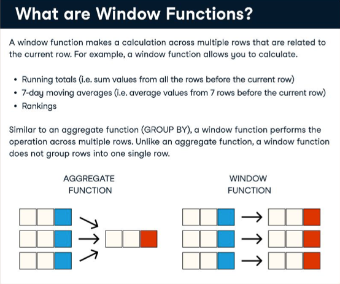
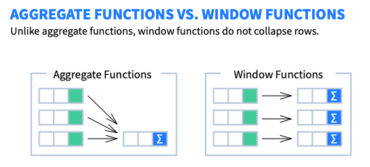
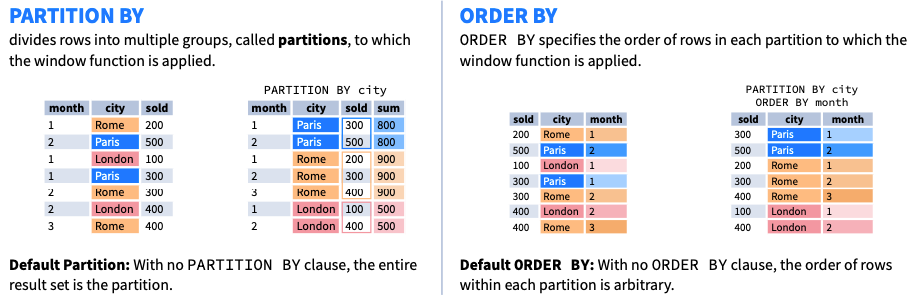

# The Hartford: Tech Catalyst Data Engineering 

* [Learning Plan](#learning-plan)
* [Student GitHub Profiles ](#Student-GitHub-Profiles )
* [Key Data Engineering Skills](#key-data-engineering-skills)
* [AI and Data Analytics Landscape](#ai-and-data-analytics-landscape)
* [AWS](#aws)
* [Python Resources](#python-pandas-resources)
* [SQL Resources](#sql-resources)
  * [SQL Window Functions](#sql-window-functions)

* [Snowflake](#snowflake)

## Learning Plan

## Student GitHub Profiles 

* [Peter Alonzo](https://github.com/peteralonzo)

* [Gina Mastrorilli](https://github.com/gmast-17)

* [Ben Combs](https://github.com/bencombsHIG)

* [Joseph Cocozza](https://github.com/JC05267)

* [Alina Baby](https://github.com/alina-hartford)

* [Zayd Ghaffar](https://github.com/ZaydGhaffar123)

* [Aryan Zodge](https://github.com/aryan-zodge-thehartford)

* [Jason Juncker](https://github.com/jasonjuncker)

* [Nithila Annadurai](https://github.com/nithilannadurai)

* [Andy Amos Mensah](https://github.com/andythehart)

* [Kaitlyn Borski](https://github.com/kaitlynborski)

* [Samee Malik](https://github.com/Smalik45)

* [Nityasriya Patturi](https://github.com/sriyapatturi)

* [Isabella Recine](https://github.com/isabella-recine)

  

  

## Key Data Engineering Skills 

[Source](https://www.tealhq.com/skills/data-engineer)

## AI and Data Analytics Landscape

* [PDF Version](https://mattturck.com/landscape/mad2024.pdf)
* [Interactive Version](https://mad.firstmark.com)

## AWS 

* Web Console Access: https://developintelligence.signin.aws.amazon.com/console

  

## Python Pandas Resources

* https://www.w3schools.com They have tutorials for Python, Pandas, and SQL
* https://automatetheboringstuff.com Great book for getting up to speed on Python
* https://wesmckinney.com/book/ Python for Data Analysis by the author of the Pandas library 

## SQL Resources

* https://www.w3schools.com They have tutorials for Python, Pandas, and SQL
* https://mode.com/sql-tutorial/introduction-to-sql 

### SQL Window Functions

* [Data Camp: Window Functions Cheat Sheet (download)](https://images.datacamp.com/image/upload/v1713890725/Marketing/Blog/SQL_Window_Functions_1_1.pdf)

* [Learn SQL: Window Functions Cheat Sheet (download)](https://learnsql.com/blog/sql-window-functions-cheat-sheet/Window_Functions_Cheat_Sheet.pdf)

  

## Snowflake

* [Snowflake Portal](https://wpa36811.snowflakecomputing.com/)
* [Snowflake TPCH Benchmark Data Model](https://docs.snowflake.com/en/user-guide/sample-data-tpch)

## GenAI Resources
* [Conversational](#Conversational-AI )
* [Searching](#searching)
* [Research and Summarization ](#Research-and-Summarization )
* [Note Taking with AI](#Note-Taking-with-AI)

### Conversational AI 

| Tool            | URL                           | Note                                                         | Fees                                           |
| --------------- | ----------------------------- | ------------------------------------------------------------ | ---------------------------------------------- |
| ChatGPT         | https://chatgpt.com           | Open AI Models: GPT-4o, GPT-4, and GPT-3.5                   | Free and Paid (Pro) options                    |
| HuggingChat     | https://huggingface.co/chat/  | You can select models such as Meta LLama3,HuggingFace Zephyer,Mistralai Mixtral, Microsoft Phi-3, and Google Gemma. Includes option for **Search Web**. *<u>See below for more details.</u>* | Free                                           |
| Le Chat Mistral | https://chat.mistral.ai/chat/ | Mistral Ai models                                            | Free                                           |
| Gemini          | https://gemini.google.com/app | Google Gemini                                                | Gemini is Free with Gemini Advanced being Paid |

### Searching

| Tool                                | URL                          | Note                                                         | Fees                                       |
| ----------------------------------- | ---------------------------- | ------------------------------------------------------------ | ------------------------------------------ |
| Perplexity AI                       | https://www.perplexity.ai    | Like Google Search but utilizing GPT for summary, and provides References. Provides citation for each summary. **Best Option in this category** | Free with an option for a Paid Pro version |
| HuggingChat with Search Web enabled | https://huggingface.co/chat/ | With Search Web enabled it will provide references for web resources | Free                                       |
| Microsoft Copilot (Bing)            |                              | Using Microsoft Edge for Bing Search and Copilot             | Free                                       |
| ChatGPT GPT-4o                      | https://chatgpt.com          | You can instruct the model to search the web and it will provide a search summary. | Free and Paid (Pro) options                |
| Claudi ai                           | https://claude.ai/chat/      | Anthropic Claud Ai                                           | Free and a Paid Pro option (Claud 3 Opus)  |

### Research and Summarization 

| Tool                     | URL                                                 | Note                                                         | Fees                                                         |
| ------------------------ | --------------------------------------------------- | ------------------------------------------------------------ | ------------------------------------------------------------ |
| Google Journalist Studio | https://journaliststudio.google.com                 | A collection of tools to empower journalists to do their work more efficiently, creatively, and securely | Free                                                         |
| Google Pinpoint          | https://journaliststudio.google.com/pinpoint/about/ | A tool to Explore and analyze large collections of documents using the best of Google’s Search and AI technology. Great tool to upload all your data collection from PDF, Audio, Video, and other file formats to enable searching, annotation, of all your content with ease.   *<u>See below for more details.</u>* | Free                                                         |
| Scispace                 | https://typeset.io                                  | Provides capabilities for Literature search, Ask Questions on PDF, Extract Data, and Paraphraser | Free Basic option, Premium Paid, and a University Paid version |
| QuillBot                 | https://quillbot.com                                | Provides capabilities for Summarization, Paraphraser, Grammar Checker, AI Detector, Plagiarism Checker, Translator, Citation Generator. | Free basic version and a Paid premium                        |
| PopAI                    | https://www.popai.pro/                              | Allows you to upload your PDF files to chat with the content for summary, Q&A as well as creating a presentation with citation/references | Free basic version and a Paid Pro version                    |
| Sharly                   | https://sharly.ai                                   | Allows you to upload your PDF files to chat with the content for summary and Q&A | Free basic version, Paid Pro version, and a Paid Business Version |

### Note Taking with AI

| Tool   | URL                   | Note                                                         | Fees                       |
| ------ | --------------------- | ------------------------------------------------------------ | -------------------------- |
| Notion | https://www.notion.so | A **Desktop**, **Web**, and **Mobile** application that allows you to capture notes, organize your thoughts and content, embed videos, PDFs, and other content.   Notion has AI enabled capabilities including Summarization, creating content, Q&A, Translation, Improve Writing, Spelling and Grammar checking, and create content for blog posts, essay, poem, to-do list, creative story, press release and more.   Notion provides browser extension “**Notion Web Clipper**” for Chrome, Safari, and Firefox to extract and convert content from the web into notion (editable) that you can then summarize and read-offline. | Free with Paid Pro version |

* Notion for Beginners Video (YouTube): https://www.youtube.com/watch?v=hbxQw4LQwws
* Intro to Notion AI (YouTube Video 1): https://www.youtube.com/watch?v=30yNRO1X7wY
* Intro to Notion AI (YouTube Video 2): https://www.youtube.com/watch?v=FElBbgnNtVA
