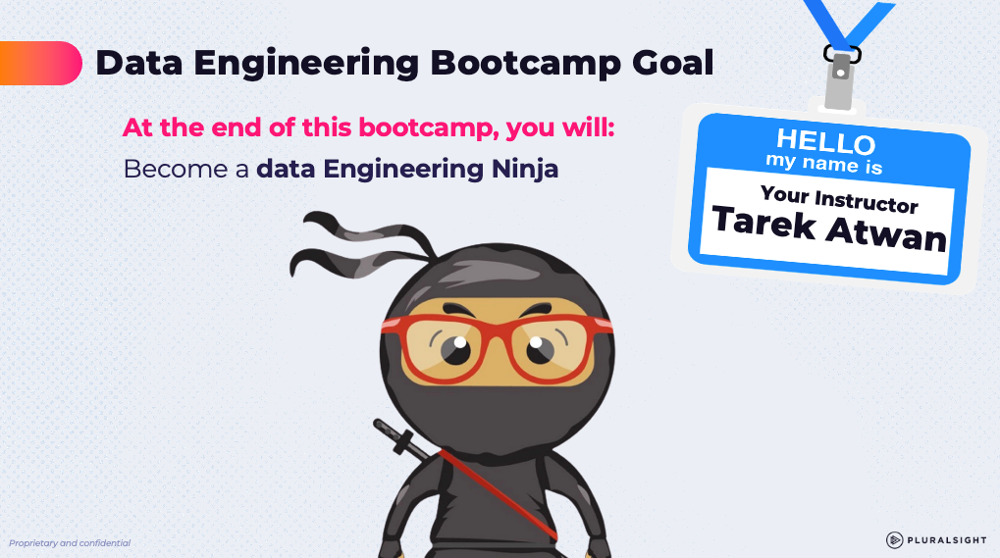

# The Hartford: Tech Catalyst Data Engineering 

## Learning Plan

## AI and Data Analytics Landscape

* [PDF Version](https://mattturck.com/landscape/mad2024.pdf)
* [Interactive Version](https://mad.firstmark.com)

## AWS 

* Web Console Access: https://developintelligence.signin.aws.amazon.com/console

  

## Python/Pandas Resources

* https://www.w3schools.com They have tutorials for Python, Pandas, and SQL
* https://automatetheboringstuff.com Great book for getting up to speed on Python
* https://wesmckinney.com/book/ Python for Data Analysis by the author of the Pandas library 

## SQL Resources

* https://www.w3schools.com They have tutorials for Python, Pandas, and SQL
* https://mode.com/sql-tutorial/introduction-to-sql 

## Snowflake

* [Snowflake Portal](https://wpa36811.snowflakecomputing.com/)
* [Snowflake TPCH Benchmark Data Model](https://docs.snowflake.com/en/user-guide/sample-data-tpch)

