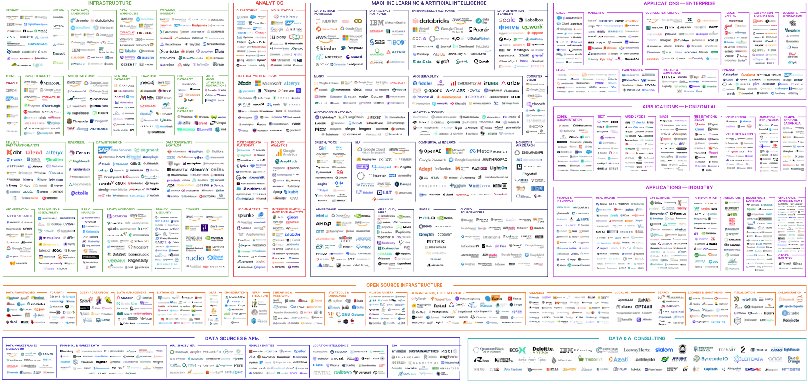

# The Hartford: Tech Catalyst Data Engineering 

* [Learning Plan](#learning-plan)
* [Key Data Engineering Skills](#key-data-engineering-skills)
* [AI and Data Analytics Landscape](#ai-and-data-analytics-landscape)
* [AWS](#aws)
* [Python Resources](#python-pandas-resources)
* [SQL Resources](#sql-resources)
  * [SQL Window Functions](#sql-window-functions)

* [Snowflake](#snowflake)

## Learning Plan

## Student GitHub Profiles 

* [Peter Alonzo](https://github.com/peteralonzo)

* [Gina Mastrorilli](https://github.com/gmast-17)

* [Ben Combs](https://github.com/bencombsHIG)

* [Joseph Cocozza](https://github.com/JC05267)

* [Alina Baby](https://github.com/alina-hartford)

* [Zayd Ghaffar](https://github.com/ZaydGhaffar123)

* [Aryan Zodge](https://github.com/aryan-zodge-thehartford)

* [Jason Juncker](https://github.com/jasonjuncker)

* [Nithila Annadurai](https://github.com/nithilannadurai)

* [Andy Amos Mensah](https://github.com/andythehart)

* [Kaitlyn Borski](https://github.com/kaitlynborski)

* [Samee Malik](https://github.com/Smalik45)

* Nityasriya Patturi

* Isabella Recine

  

  

## Key Data Engineering Skills 

[Source](https://www.tealhq.com/skills/data-engineer)

## AI and Data Analytics Landscape

* [PDF Version](https://mattturck.com/landscape/mad2024.pdf)
* [Interactive Version](https://mad.firstmark.com)

## AWS 

* Web Console Access: https://developintelligence.signin.aws.amazon.com/console

  

## Python Pandas Resources

* https://www.w3schools.com They have tutorials for Python, Pandas, and SQL
* https://automatetheboringstuff.com Great book for getting up to speed on Python
* https://wesmckinney.com/book/ Python for Data Analysis by the author of the Pandas library 

## SQL Resources

* https://www.w3schools.com They have tutorials for Python, Pandas, and SQL
* https://mode.com/sql-tutorial/introduction-to-sql 

### SQL Window Functions

* [Data Camp: Window Functions Cheat Sheet (download)](https://images.datacamp.com/image/upload/v1713890725/Marketing/Blog/SQL_Window_Functions_1_1.pdf)

* [Learn SQL: Window Functions Cheat Sheet (download)](https://learnsql.com/blog/sql-window-functions-cheat-sheet/Window_Functions_Cheat_Sheet.pdf)

  

## Snowflake

* [Snowflake Portal](https://wpa36811.snowflakecomputing.com/)
* [Snowflake TPCH Benchmark Data Model](https://docs.snowflake.com/en/user-guide/sample-data-tpch)

