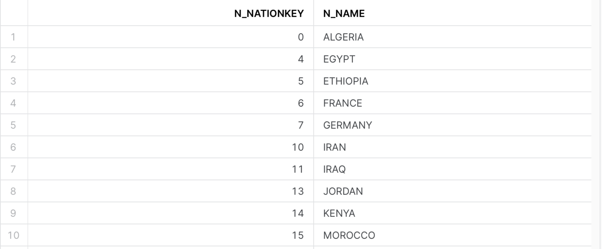
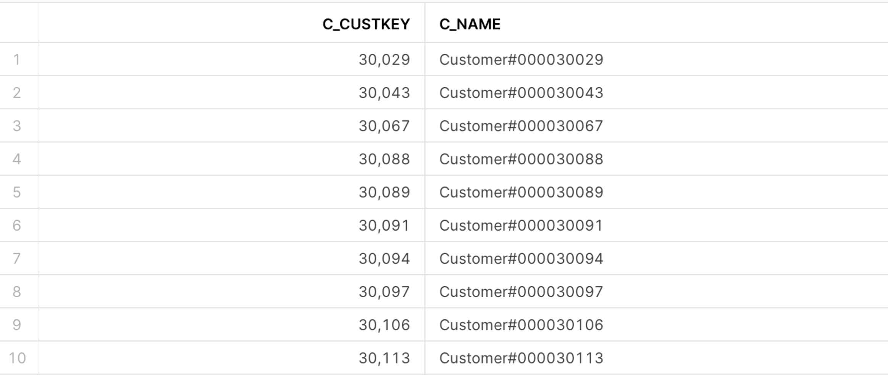

## 3.2.2 Activity

## Exercise 8-1

Write a query against the `Nation` table that uses a subquery on the `Region` table to return the names of all nations except those in the America and Asia regions.

## Exercise 8-2

Write a query against the `Customer` table that returns the `c_custkey` and `c_name` columns for all customers who placed exactly four orders in 1997. Use a subquery against the `Orders` table.

