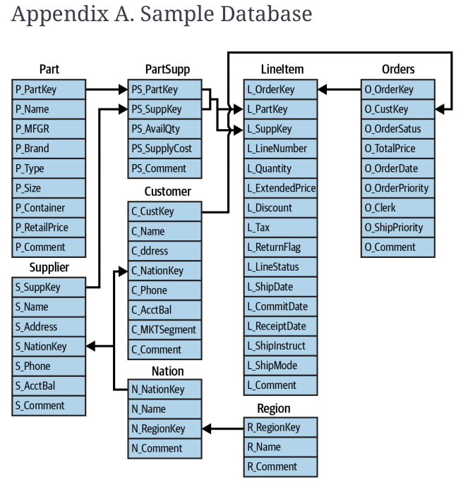

## 3.3.2 Activities

> Hints: 
>
> Account Balance is `s_acctbal` from the `SUPPLIER` table 
>
> Market Segment is `c_mktsegment` from the `CUSTOMER` table

### Exercise 1 **Suppliers with High Account Balance**

- Write a SQL query to retrieve the top 5 suppliers who have the highest account balance. Include the supplier's name, nation, and account balance. Sort the results by account balance in descending order.

### Exercise 2 **Average Order Value by Year**

- Calculate the average order value for each year. Display the year and the corresponding average order value.

### Exercise 3 Total Revenue of Automobile Market Segment

* Find the total revenue generated from the 'AUTOMOBILE' market segment.

### Exercise 4 Best Nation

* Determine which nation has the most suppliers.

### Exercise 5 Which Month?

* Find the month in which the highest number of orders were placed.

### Exercise 6 Average Discount by Market Segment

* Calculate the average discount given on orders for each market segment.

### Exercise 7 Top 3 Nations

* Determine the top 3 nations that have the highest average account balances for their suppliers.

