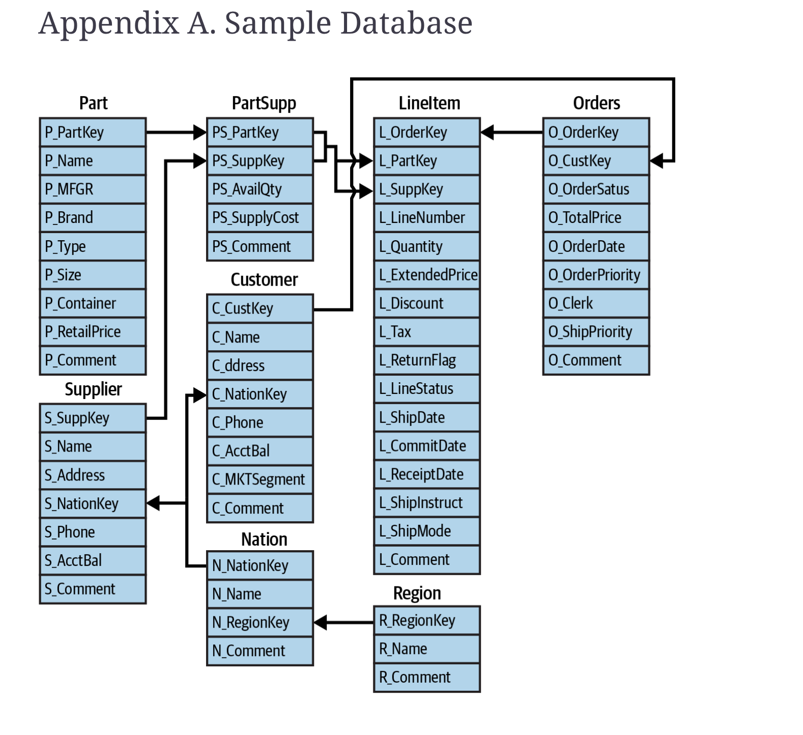
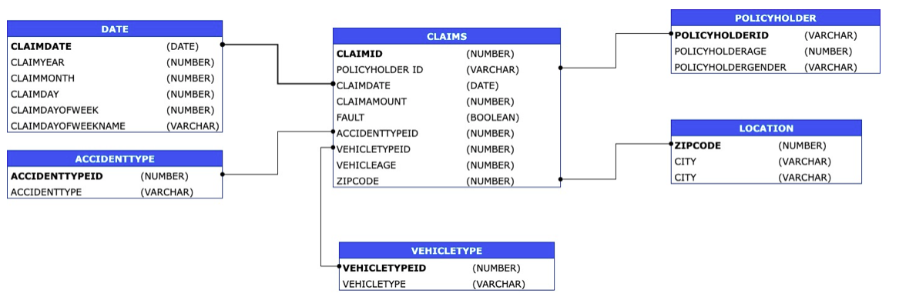
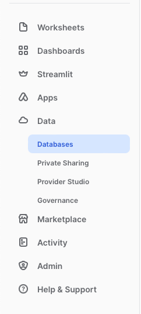
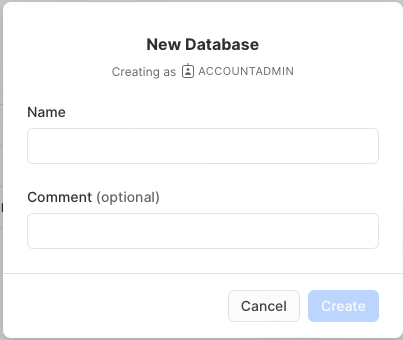
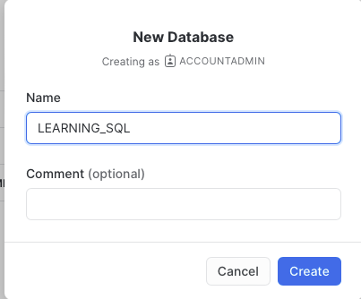
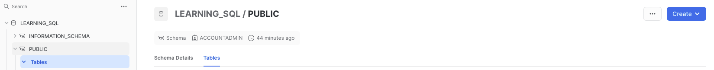
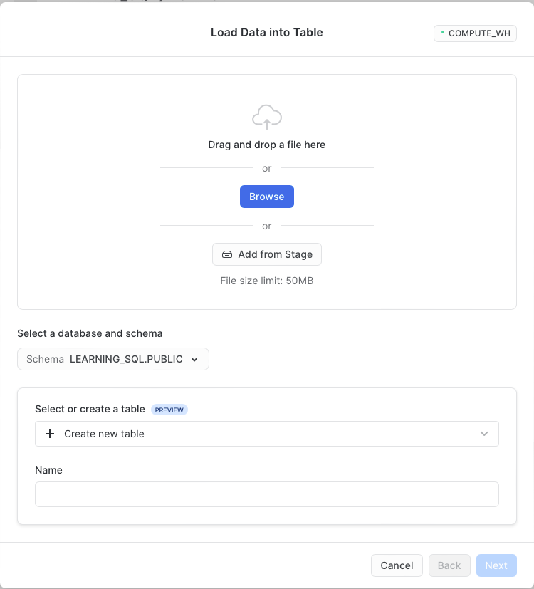

# Snowflake Exercises and Scripts

As we practice **SQL** and **Snowflake** we will be using TWO datasets throughout. The sample data provided by Snowflake `TPCH_SF1` and the `CLAIMS` dataset you used earlier in the Grace Period Project. 

## TPCH_SF1 Dataset 

Below is the ER-Diagram for the sample data provided by Snowflake for your reference.



## Claims Dataset

Below is the ER-Diagram for the Claims dataset for your reference. 



### Creating a new Database

* You can create a database using the Snowflake Console (Web Interface)



Click **+ Database** as shown below:




Enter a name for the database 



> ### Note
>
> Alternatively you can create a database using SQL , Scripts are provided in the **Scripts** folder
>
> ```sql
> create database learning_sql
> ```
>
> In the remaining instructions you will use the Snowflake Console (Web Interface). Later on you will learn how to accomplish the same tasks using SQL Code (Script). 

### Loading CSV files to Snowflake

You can load datasets as Tables into the **new** Database you just created using the Snowflake Console (Web Interface)



* To Load the Data manually from a `CSV` source click *Tables then **Create** select **Table** then **From File***


* Click **Browse**, then navigate to the specific file you want to load. <u>You will need to do this step for each file you have</u>.





* Before the data is loaded, Snowflake will try and determine (infer) what the table schema should look like (table structure and data types). Review and confirm that the information is correct, then click on **Load**. 


* Once you perform the pervious steps (Create Table, Browse File, Confirm Schema, Load Data) for each file you should have a list of all the tables created as shown below:


----

