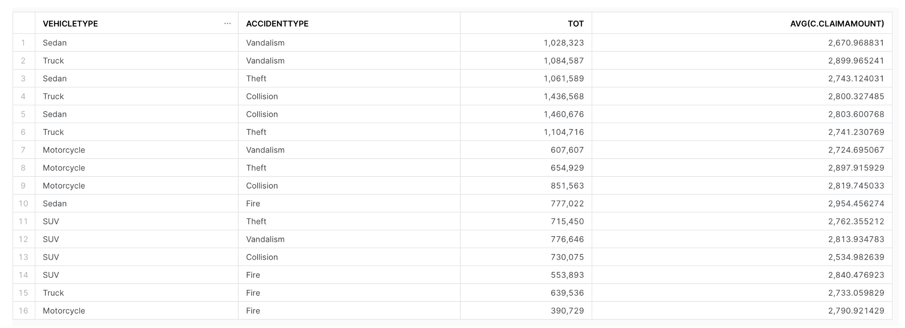

Create a Target table named `CLAIM_BY_TYPE_<your login name>` make sure to replace the` <your login name> `with your actual login name.

```sql
create or replace TABLE TARGET_DB.REPORTING.CLAIM_BY_TYPE_TATWAN (
	VEHICLETYPE VARCHAR(16777216),
	ACCIDENTTYPE VARCHAR(16777216),
	TOTAL_CLAIM_AMOUNT NUMBER(38,0),
	AVG_CLAIM_AMOUNT NUMBER(38,6)
);
```

Write an ETL Script in SQL that would pull the data from the HSBDA database, from your own SCHEMA to the target database and schema. The results should look like this:

