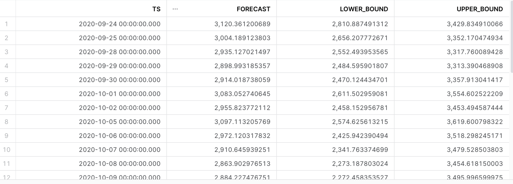

# Forecasting 

```sql
CREATE SNOWFLAKE.ML.FORECAST amzn_forecast (
 INPUT_DATA => SYSTEM$REFERENCE('TABLE', 'HSBDA.TATWAN.AMZN_STOCK'),
  TIMESTAMP_COLNAME => 'DATE',
  TARGET_COLNAME => 'CLOSE'
);

SHOW SNOWFLAKE.ML.FORECAST;

CALL AMZN_FORECAST!FORECAST(FORECASTING_PERIODS => 30);

CALL  AMZN_FORECAST!EXPLAIN_FEATURE_IMPORTANCE();
```



