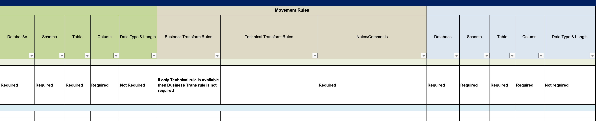

# 4.4.0 Activity

## Data Mapping Document 

* You are given requirements for an ETL process that takes data from a source system (3 tables) into a Data Warehouse. The business sends you the following for the source tables

* They also send you what they expect in the Target table

* You will need to create a Data Mapping Table to assist the ETL developer in understanding what is needed to accomplish. The ETL developer will rely on your instructions and specifications. This includes the transformations from source to target. 
* List any assumptions in the document 
* The following template was suggested by the business as a starting point

## Writing User Story 

Write a User Story but assume the audience are semi-technical and data literate and have some understanding of relational databases and SQL.

* In SQL pseudo language, what do you think is the business trying to do?
  * You are not writing SQL here, but explaining in English what would be done if you are to write it in SQL
    * *Example*: They are trying to **join** A and B in order to get all the columns (Col1, Col2, Col3) from Source A and (Col4, Col5) from Source B aligned through an **Inner Join** (on Col1 from A = Col1 from B). 

* You will need to create a flow diagram or chart, either in Excel, PowerPoint, or Draw.io , to show the process (high level reference architecture). 

----

When done. Please submit (individually) your data mapping and any other supporting documents you have created via the Zoom chat.
