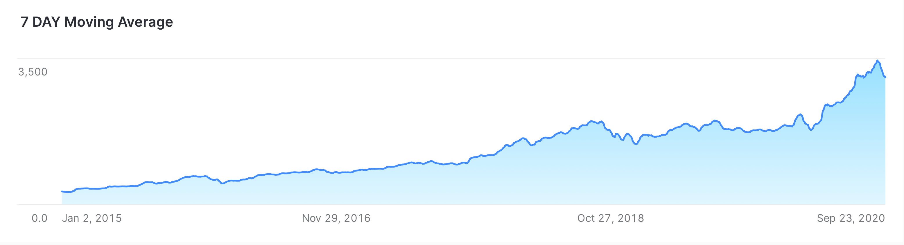
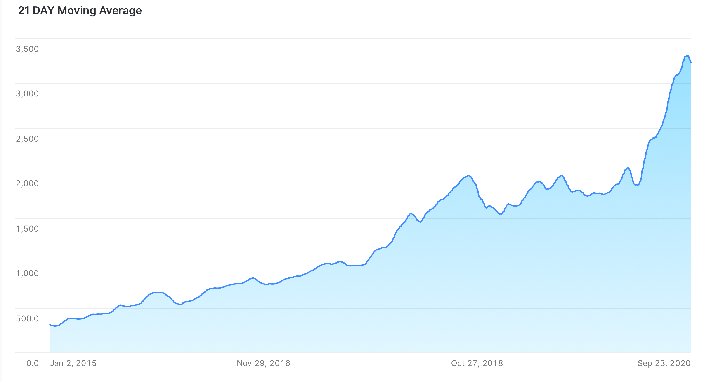
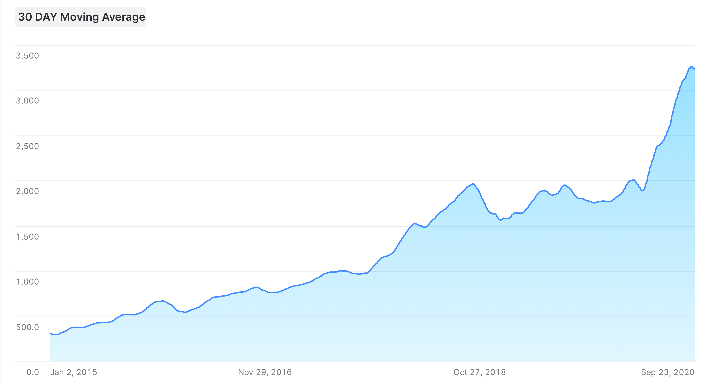
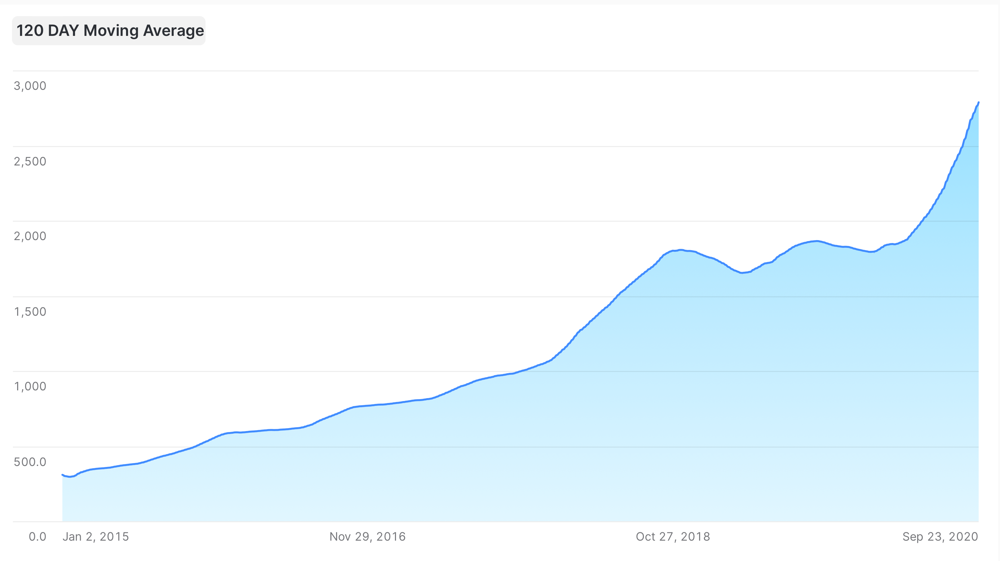
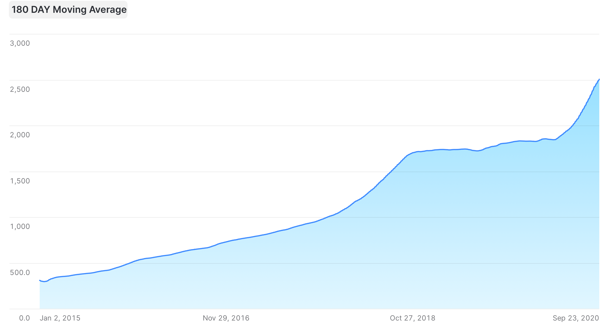

# 4.4.2 Stock Analysis Solution

```sql
USE SCHEMA FUN_DB.STOCKS;


SELECT * FROM AMZN_STOCK WHERE YEAR(DATE) > 2015;


CREATE TEMPORARY TABLE HSBDA.TATWAN.AMZN_STOCK as 
SELECT DATE
,CLOSE
FROM FUN_DB.STOCKS.AMZN_STOCK WHERE YEAR(DATE) >= 2015;

USE SCHEMA HSBDA.TATWAN;

SELECT * 
FROM AMZN_STOCK;


SELECT DATE
,CLOSE
,LAG(CLOSE, 1) OVER (ORDER BY DATE) as PREV_CLOSE
,ROUND(((CLOSE - PREV_CLOSE)/(CLOSE)) * 100, 2) as PERCENT_CHANGE
,AVG(CLOSE) OVER (
                    ORDER BY DATE
                    ROWS BETWEEN 6 PRECEDING AND CURRENT ROW -- 7 day trailing moving average:
                    ) as MA_7_DAY_TRAILING
,AVG(CLOSE) OVER (
                    ORDER BY DATE
                    ROWS BETWEEN 20 PRECEDING AND CURRENT ROW -- 21 day trailing moving average:
                    ) as MA_21_DAY_TRAILING
,AVG(CLOSE) OVER (
                    ORDER BY DATE
                    ROWS BETWEEN 29 PRECEDING AND CURRENT ROW -- 30 day trailing moving average:
                    ) as MA_30_DAY_TRAILING
,AVG(CLOSE) OVER (
                    ORDER BY DATE
                    ROWS BETWEEN 119 PRECEDING AND CURRENT ROW -- 120 day trailing moving average:
                    ) as MA_120_DAY_TRAILING
,AVG(CLOSE) OVER (
                    ORDER BY DATE
                    ROWS BETWEEN 179 PRECEDING AND CURRENT ROW -- 180 day trailing moving average:
                    ) as MA_180_DAY_TRAILING
FROM AMZN_STOCK;
```











