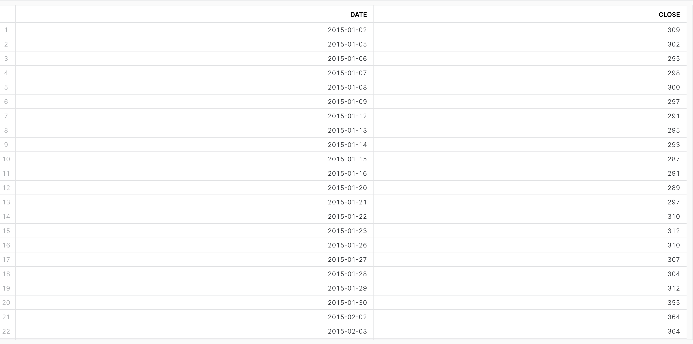
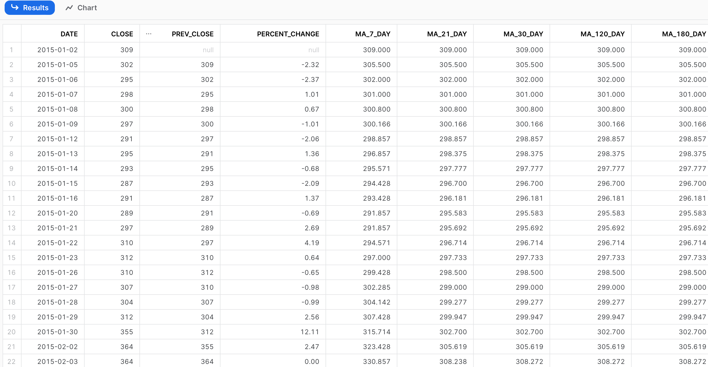
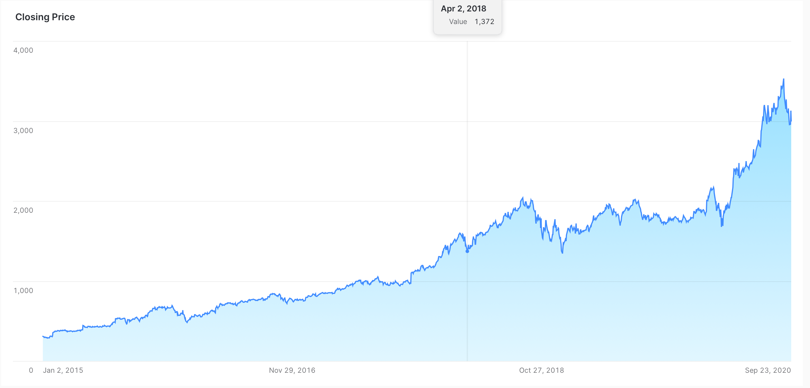
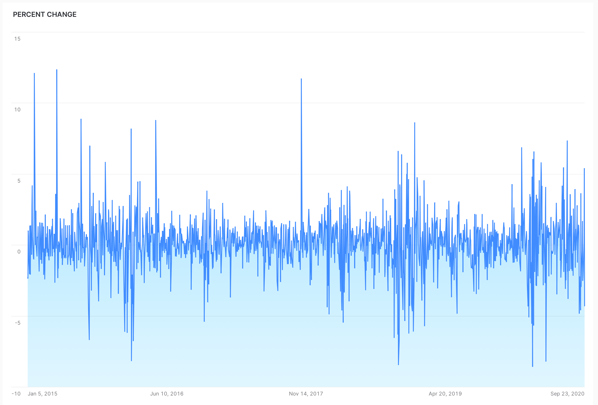

# Amazon Stock Data

### STEP 1

**ETL** Extract the data from the `AMZN_STOCK` table located in the  ` FUN_DB` Database in the `STOCKS` schema and move the data to your schema in HSBDA (example `HSBDA.TATWAN.AMZN_STOCK`) where AMZN_STOCK is a `TEMPORARY TABLE`. You will only migrate data including 2015 and beyond.  The Data should only contain TWO columns: `DATE` and `CLOSE ` columns. 

`CLOSE` is the closing price of the Amazon Stock.

### STEP 2

>  **YOU SHOULD BE RUNNING THE ANALYSIS NOW USING YOUR OWN COPY OF THE DATA IN YOUR OWN SCHEMA**

Make sure you switch to the new Database and Schema using the `USE` clause (for example `USE SCHEMA HSBDA.TATWAN`)

Make sure when you run `SELECT * FROM AMZN_STOCK` you see the following

### STEP 3

Calculate:

* `PREV_CLOSE` this is the closing price of the previous day
* `PERCENT_CHANGE` this is the percent change between the current closing pice and previous closing price calculated as 

$$
\Large \frac{\text{CURRENT PRICE}- PREVIOUS PRICE}{\text{CURRENT PRICE}} \times 100
$$

* `MA_7_DAY` Calculate a 7 day moving average 
* `MA_21_DAY`  Calculate a 21 day moving average 
* `MA_30_DAY`  Calculate a 30 day moving average 
* `MA_120_DAY` Calculate a 120 day moving average 
* `MA_180_DAY` Calculate a 180 day moving average 

See the following example. 

### STEP 4

Visualize the results n Snowflake 

Below shows two examples: **Closing price over time** and **Percent Change over time**

* **WHAT IS ANOTHER NAME FOR PERCENT CHANGE IN STOCK ANALYSIS?**

* **HOW CAN YOU INTERPRET THE PERCENT CHANGE CHART?**

* **CREATE 4 CHARTS FOR EACH OF THE CALCULATED MOVING AVERAGES. CAN YOU SPOT ANY INTERESTING OBSERVATIONS ?**

