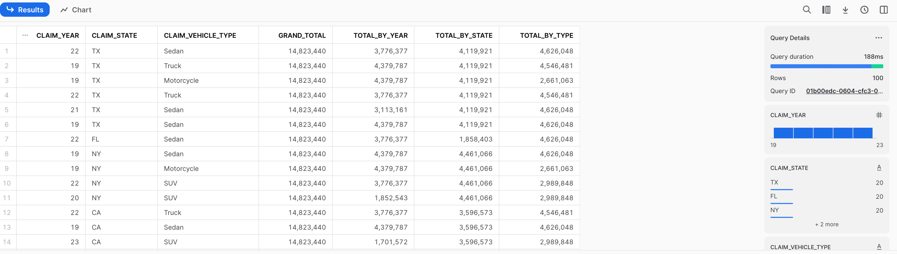
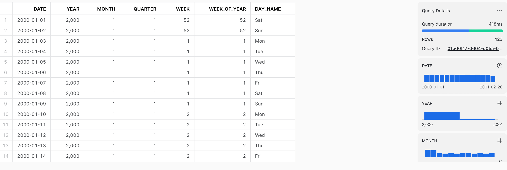

# 5.4.1

## PART 1

* Create a new table in the `PRACTICE` Database under the `CLAIMS` schema. Name the table with your login as shown in the example below `YOURLOGIN_FINAL` 
  * In this example I am using `TATWAN_FINAL`

```sql
create or replace TABLE PRACTICE.CLAIMS.TATWAN_FINAL (
	CLAIM_YEAR NUMBER(4,0),
	CLAIM_STATE VARCHAR(16777216),
	CLAIM_VEHICLE_TYPE VARCHAR(16777216),
	GRAND_TOTAL NUMBER(38,0),
	TOTAL_BY_YEAR NUMBER(38,0),
	TOTAL_BY_STATE NUMBER(38,0),
	TOTAL_BY_TYPE NUMBER(38,0)
);
```

* Now, write a query using table in the ` hsbda.tatwan` schema and insert into the new table you just created.
* To do so, you can just reference the `database.schema.table` in the FROM clause as shown below

```sql
--Example
from hsbda.tatwan.claims as c
```

* To perform an ETL (Extracting from the `HSBDA.TATWAN` schema and writing to the` PRACTICE.CLAIMS` schema) you will use the `INSERT INTO` clause. When you insert into the table you will reference the new schema as shown below.

```sql
INSERT INTO practice.claims.tatwan_final  
(
  -- YOUR QUERY HERE
)
```

Replace the `tatwan_final` with yours.

* If you made a mistake and want to delete the data in the table you can use the `TRUNCATE` command. This example remove the data from my table. You will just need to replace `TATWAN_FINAL` with your own.

```sql
truncate table practice.claims.tatwan_final;
```

* To validate you have the right data you can run a SELECT statement but reference the proper table in the FROM clause.  This is an alternative to switching the schema or using the `USING` clause

```sql
select * from practice.claims.tatwan_final;
```

* The final output should look like this




## PART 2

Use the `SOURCE_DATE` table in the HSBDA database in TATWAN schema and perform ETL to populate a new table in the PRACTICE database under the CLAIMS schema. Name the table as `DATE_TARGET_YOURLOGIN` for example `DATE_TARGET_TATWAN`

Here is the DDL for creating the shell table:

```sql
create or replace TABLE PRACTICE.CLAIMS.DATE_TARGET_TATWAN (
	DATE DATE,
	YEAR NUMBER(4,0),
	MONTH NUMBER(2,0),
	QUARTER NUMBER(2,0),
	WEEK NUMBER(2,0),
	WEEK_OF_YEAR NUMBER(2,0),
	DAY_NAME VARCHAR(3)
);
```

The final output should look like this



