# Yellow Taxi


## TASK 1

**Data Migration/ETL**

* Move the data from the `TECHCATALYST_DE.PUBLIC` schema into your personal schema. 
* Unify/integrate the four data sets into one large data set with the following definition:
* Make sure it is a `TRANSIENT` table and that it is created in your own schema 

```sql
CREATE OR REPLACE TRANSIENT TABLE TECHCATALYST_DE.TATWAN.YELLOW_TAXI (
    VENDORID NUMBER(38,0),
    TPEP_PICKUP_DATETIME TIMESTAMP,
    TPEP_DROPOFF_DATETIME TIMESTAMP,
    YEAR_SERVICE NUMBER,
    MONTH_SERVICE NUMBER,
    PASSENGER_COUNT NUMBER(38,0),
    TRIP_DISTANCE FLOAT,
    RATECODEID NUMBER(38,0),
    STORE_AND_FWD_FLAG VARCHAR(1),
    PULOCATIONID NUMBER(38,0),
    DOLOCATIONID NUMBER(38,0),
    PAYMENT_TYPE NUMBER(38,0),
    FARE_AMOUNT FLOAT,
    EXTRA FLOAT,
    MTA_TAX FLOAT,
    TIP_AMOUNT FLOAT,
    TOLLS_AMOUNT FLOAT,
    IMPROVEMENT_SURCHARGE FLOAT,
    TOTAL_AMOUNT FLOAT,
    CONGESTION_SURCHARGE FLOAT,
    AIRPORT_FEE FLOAT,
    MONTH_FILE VARCHAR(10) -- or DATE column depending on your needs
);
```

```sql
-- Example inserting the 2024-04 data 
INSERT INTO TECHCATALYST_DE.TATWAN.YELLOW_TAXI
SELECT 
    VENDORID,
    TO_TIMESTAMP(TPEP_PICKUP_DATETIME / 1000000) AS TPEP_PICKUP_DATETIME,
    TO_TIMESTAMP(TPEP_DROPOFF_DATETIME / 1000000) AS TPEP_DROPOFF_DATETIME,
    YEAR(DATE(TPEP_PICKUP_DATETIME)),
    MONTH(DATE(TPEP_PICKUP_DATETIME)),
    PASSENGER_COUNT,
    TRIP_DISTANCE,
    RATECODEID,
    STORE_AND_FWD_FLAG,
    PULOCATIONID,
    DOLOCATIONID,
    PAYMENT_TYPE,
    FARE_AMOUNT,
    EXTRA,
    MTA_TAX,
    TIP_AMOUNT,
    TOLLS_AMOUNT,
    IMPROVEMENT_SURCHARGE,
    TOTAL_AMOUNT,
    CONGESTION_SURCHARGE,
    AIRPORT_FEE,
    '2024-04' AS MONTH
FROM TECHCATALYST_DE.PUBLIC.YELLOW_TAXI_2024_04;
```


**Write your own query**

```sql
SELECT count(*) from TECHCATALYST_DE.TATWAN.YELLOW_TAXI;
```


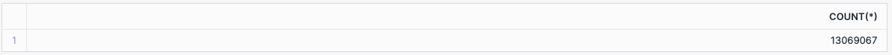

## TASK 2 

**Data Validation**

* Count the total number of trips and sum up the fare amounts for each month. USE the `MONTH_FILE` column 

```sql
SELECT MONTH_FILE,
    COUNT(*) AS total_trips, 
    SUM(FARE_AMOUNT) AS total_fare_amount
FROM TECHCATALYST_DE.TATWAN.YELLOW_TAXI
GROUP BY MONTH_FILE
ORDER BY MONTH_FILE;
```


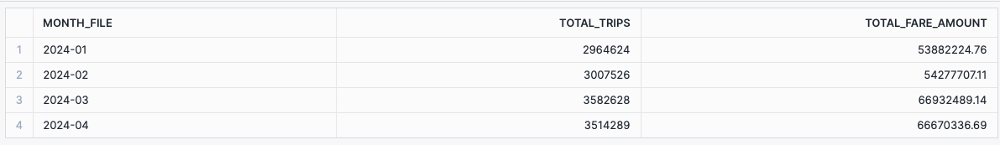

* Observe the distribution of `vendorid` values, including the count of NULL values.

```sql
SELECT vendorid, COUNT(*) "Count"
FROM  YELLOW_TAXI
GROUP BY vendorid
ORDER BY 1;
```


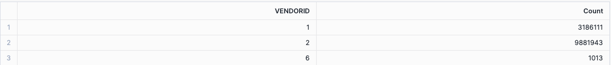

* Observe the distribution of `pulocationid` values.

```sql
SELECT pulocationid, COUNT(*) "Count"
FROM YELLOW_TAXI
GROUP BY pulocationid
ORDER BY 1;
```


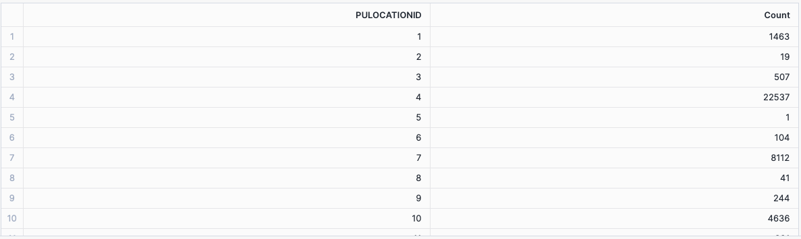

* Observe the distribution of `payment_type` values, including the count of NULL values.

```sql
SELECT payment_type, COUNT(*) "Count"
FROM YELLOW_TAXI
GROUP BY payment_type
ORDER BY 1;
```


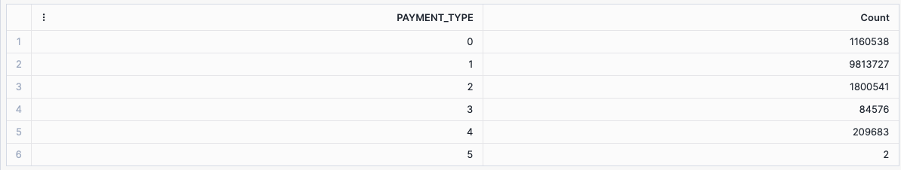

* Explore records with NULL `vendorid` and observe other columns that might also have NULL values.

```sql
SELECT * 
FROM YELLOW_TAXI
WHERE vendorid IS NULL
LIMIT 100;
```


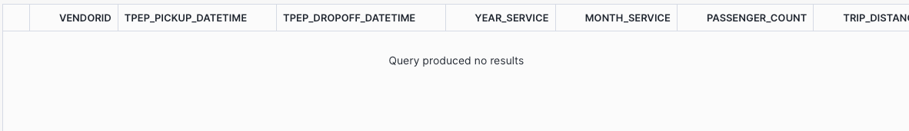

* Observe the count of records grouped by the time period in the format `YYYY-MM` from the `tpep_pickup_datetime` column.

```sql
SELECT SUBSTR(tpep_pickup_datetime, 1, 7) "Period", COUNT(*) "Total Records"
FROM YELLOW_TAXI
GROUP BY SUBSTR(tpep_pickup_datetime, 1, 7) 
ORDER BY 1;

```


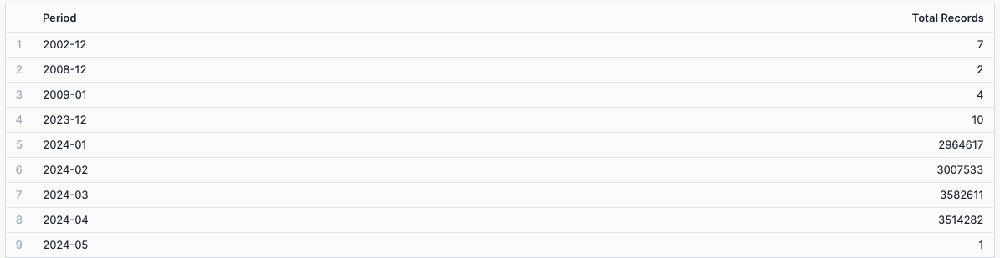

Hint: one option you can consider is using the `SUBSTR` function 


## TASK 3 

**Data Analysis**

* Determine the average fare amount for trips with different payment types in April 2024.
  * User `MONTH_FILE` 

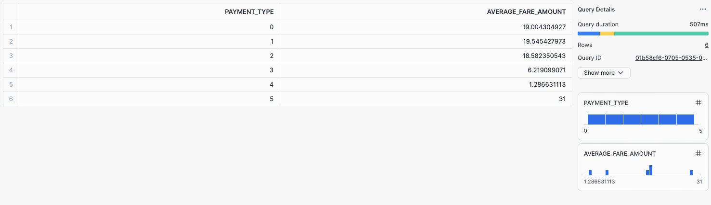

* Find the percentage of trips that had tips in March 2024.
  * User `MONTH_FILE`
  * HINT: USE `CASE WHEN` 
    * `TIP_AMOUNT` indicates the tip amount for each trip. If the value is greater than 0, it means a tip was given.
    * Use the `CASE` statement within the `SUM` function to count the number of trips with a `TIP_AMOUNT` greater than 0. Divide the number of trips with tips by the total number of trips and multiply by 100 to get the percentage.

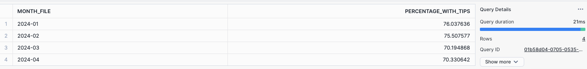

```sql
SELECT 
    MONTH_FILE,
    (SUM(CASE WHEN TIP_AMOUNT > 0 THEN 1 END) * 100.0 / COUNT(*)) AS percentage_with_tips
FROM TECHCATALYST_DE.TATWAN.YELLOW_TAXI
GROUP BY MONTH_FILE
ORDER BY MONTH_FILE;

-- OR

SELECT 
    MONTH_FILE,
    (COUNT(CASE WHEN TIP_AMOUNT > 0 THEN 1 END) * 100.0 / COUNT(*)) AS percentage_with_tips
FROM TECHCATALYST_DE.TATWAN.YELLOW_TAXI
GROUP BY MONTH_FILE
ORDER BY MONTH_FILE;
```


* Calculate the cumulative total fare amount collected up to each trip for each month in 2024.
  * HINT: Use Window Function and GROUP BY
    * `Service_Day_of_Month` you will need to extract 

```sql
SELECT
    MONTH_FILE,
    DAY(TPEP_PICKUP_DATETIME) as Service_Day_of_Month,
    SUM(FARE_AMOUNT),
    SUM(SUM(FARE_AMOUNT)) OVER (PARTITION BY MONTH_FILE ORDER BY DAY(TPEP_PICKUP_DATETIME)) AS cumulative_total_fare
FROM TECHCATALYST_DE.TATWAN.YELLOW_TAXI
GROUP BY MONTH_FILE, DAY(TPEP_PICKUP_DATETIME)
ORDER BY MONTH_FILE, DAY(TPEP_PICKUP_DATETIME);
```


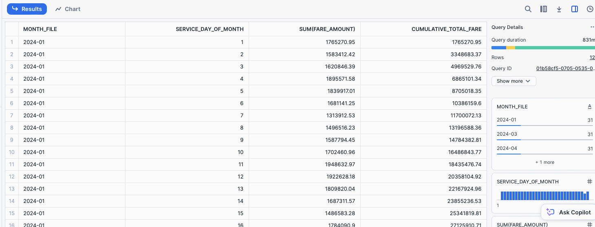


* **CHALLENGE** Identify the trip with the maximum fare amount for each day in January 2024.
  * Use `MONTH_FILE` 
  * HINT: You can consider using a WINDOW FUNCTION and CTE
  * HINT: Look into ROW_NUMBER() 

```sql
WITH ranked_trips AS (
    SELECT 
        TPEP_PICKUP_DATETIME::DATE AS trip_date,
        VENDORID,
        TPEP_PICKUP_DATETIME,
        TPEP_DROPOFF_DATETIME,
        PASSENGER_COUNT,
        TRIP_DISTANCE,
        FARE_AMOUNT,
        ROW_NUMBER() OVER (PARTITION BY TPEP_PICKUP_DATETIME::DATE ORDER BY FARE_AMOUNT DESC) AS row_num
    FROM TECHCATALYST_DE.TATWAN.YELLOW_TAXI
    WHERE MONTH_FILE = '2024-01'
)
SELECT 
    trip_date,
    VENDORID,
    TPEP_PICKUP_DATETIME,
    TPEP_DROPOFF_DATETIME,
    PASSENGER_COUNT,
    TRIP_DISTANCE,
    FARE_AMOUNT
FROM ranked_trips
WHERE row_num = 1
ORDER BY trip_date;
```


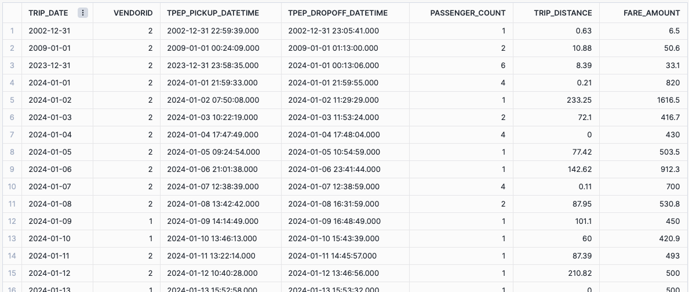


## TASK 4

### Creating a View to Enhance Readability of Yellow Taxi Data for Business Users

In this exercise, you will create a view named `v_yellow_tripdata` that transforms raw taxi trip data into a more readable and meaningful format. This view will replace numeric codes with descriptive text for several key columns, making the data easier to interpret. Follow the steps below to understand the requirements and logic behind this transformation.

#### Step-by-Step Instructions

1. **Understanding the Source Table**: The source table `YELLOW_TAXI` contains the raw trip data. Key columns include:
   - `vendorid`: Numeric identifier for the vendor.
   - `tpep_pickup_datetime` and `tpep_dropoff_datetime`: Timestamps for when the trip started and ended.
   - `passenger_count`: Number of passengers in the trip.
   - `trip_distance`: Distance of the trip.
   - `ratecodeid`: Numeric identifier for the rate code.
   - `store_and_fwd_flag`: Flag indicating if the trip record was held in vehicle memory before sending to the vendor.
   - `payment_type`: Numeric identifier for the payment method.
   - `fare_amount`, `extra`, `mta_tax`, `tip_amount`, `tolls_amount`, `improvement_surcharge`, `congestion_surcharge`, and `total_amount`: Various monetary amounts associated with the trip.
2. **Creating Descriptive Column Values**: (Data Enrichment)
   - Vendor Name as `vendor_name`:
     - `1` should be displayed as "Creative Mobile".
     - `2` should be displayed as "VeriFone".
     - Any other value should be displayed as "No Data".
   - Rate Type as `rate_type`:
     - `1` should be displayed as "Standard Rate".
     - `2` should be displayed as "JFK".
     - `3` should be displayed as "Newark".
     - `4` should be displayed as "Nassau/Westchester".
     - `5` should be displayed as "Negotiated Fare".
     - `6` should be displayed as "Group Ride".
     - `99` should be displayed as "Special Rate".
     - Any other value should be displayed as "No Data".
   - Payment Type as `payment_type`:
     - `1` should be displayed as "Credit Card".
     - `2` should be displayed as "Cash".
     - `3` should be displayed as "No Charge".
     - `4` should be displayed as "Dispute".
     - `5` should be displayed as "Unknown".
     - `6` should be displayed as "Voided Trip".
     - Any other value should be displayed as "No Data".
3. **Constructing the SQL Query**:
   - Use the `CASE` statement to convert numeric codes to descriptive text.
   - Select all relevant columns and apply the `CASE` transformations as necessary.
4. **Creating the View**:
   - Use the `CREATE OR REPLACE VIEW` statement to define the view `v_yellow_tripdata`.
   - Include all transformed columns in the `SELECT` statement.

Example output from the VIEW

```sql
CREATE OR REPLACE VIEW v_yellow_tripdata
AS
SELECT CASE vendorid
            WHEN 1 THEN 'Creative Mobile'
            WHEN 2 THEN 'VeriFone'
            ELSE 'No Data'
       END "vendor_name",
       tpep_pickup_datetime,
       tpep_dropoff_datetime,
       passenger_count,
       trip_distance,
       CASE ratecodeid
            WHEN 1 THEN 'Standard Rate'
            WHEN 2 THEN 'JFK'
            WHEN 3 THEN 'Newark'
            WHEN 4 THEN 'Nassau/Westchester'
            WHEN 5 THEN 'Negotiated Fare'
            WHEN 6 THEN 'Group Ride'
            WHEN 99 THEN 'Special Rate'
            ELSE 'No Data'
       END "rate_type",
       store_and_fwd_flag,
       CASE payment_type
            WHEN 1 THEN 'Credit Card'
            WHEN 2 THEN 'Cash'
            WHEN 3 THEN 'No Charge'
            WHEN 4 THEN 'Dispute'
            WHEN 5 THEN 'Unknown'
            WHEN 6 THEN 'Voided Trip'
            ELSE 'No Data'
       END "payment_type",
       fare_amount,
       extra,
       mta_tax,
       tip_amount,
       tolls_amount,
       improvement_surcharge,
       congestion_surcharge,
       total_amount
FROM   YELLOW_TAXI;
```


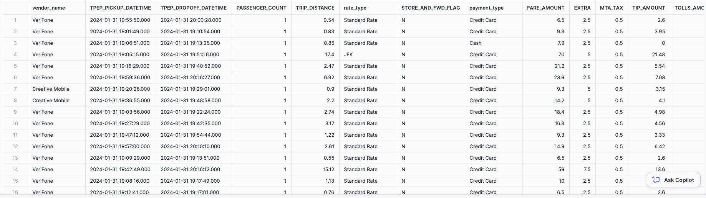