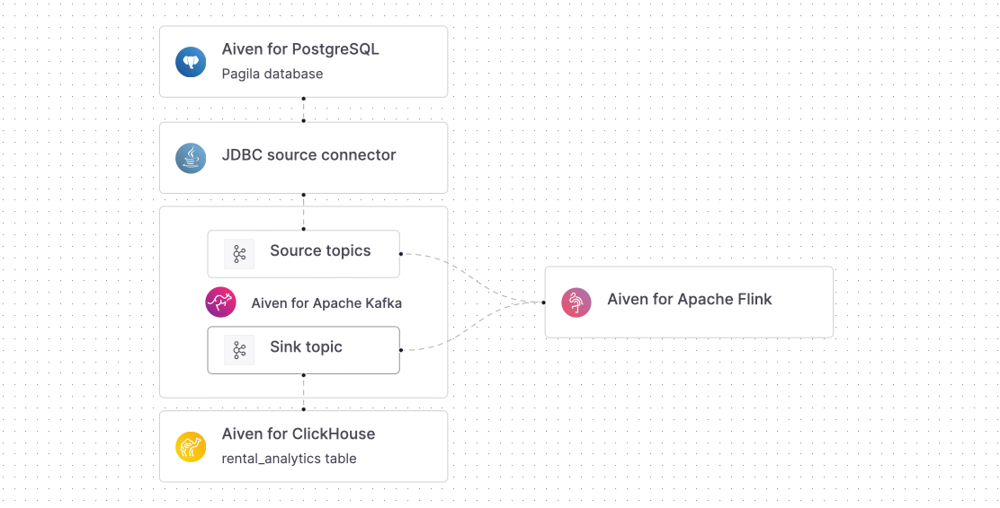
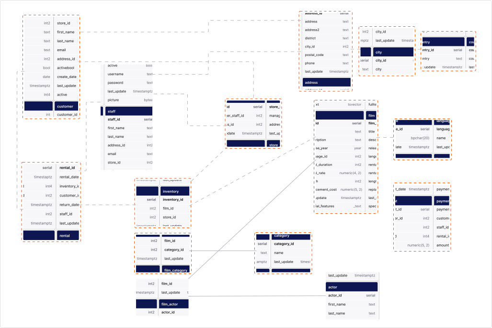
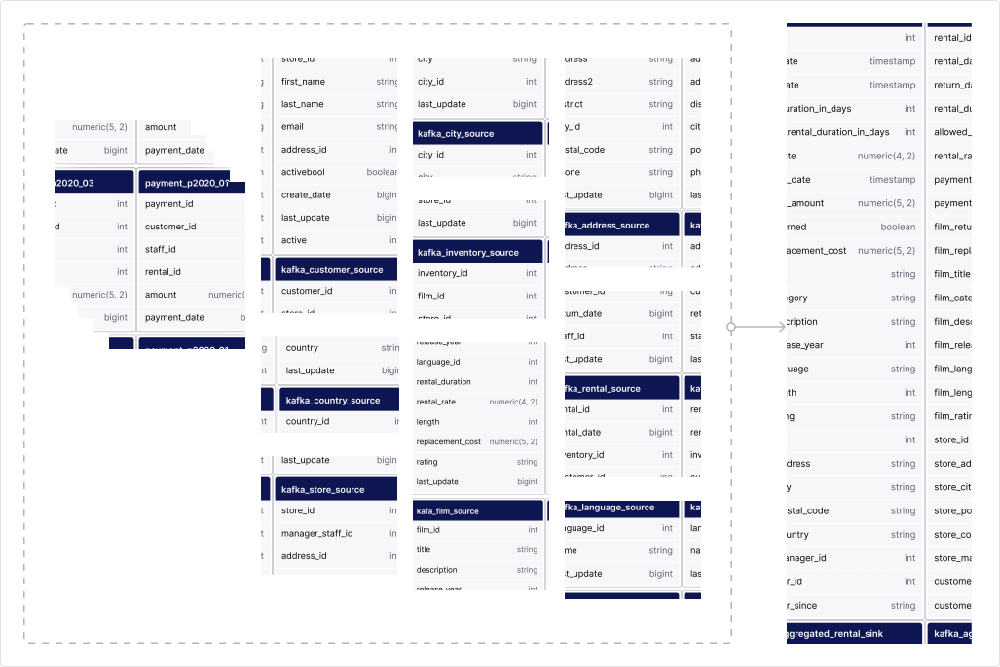

# Overview

With this data pipeline, you'll send sample Pagila dataset from an Aiven for PostgreSQL operational database to an Aiven for ClickHouse data warehouse for analysis.

Data pipeline step by step:

1. You use Aiven Console or Terraform to build the following infrastructure:

2. The Pagila dataset is read from Aiven for PostgreSQL and sent to Aiven for Apache Kafka using the JDBC source connectors. The connectors stream data from the Pagila database tables into specific topics in Aiven for Apache Kafka.

3. The Aiven for Apache Flink service processes and aggregates the streamed data to the `kafka_aggregated_rental_sink` sink table. The Aiven for Apache Flink service enhances data by replacing IDs with descriptive names, such as store locations and film titles. This enables data analysis using the query editor of Aiven for ClickHouse.

