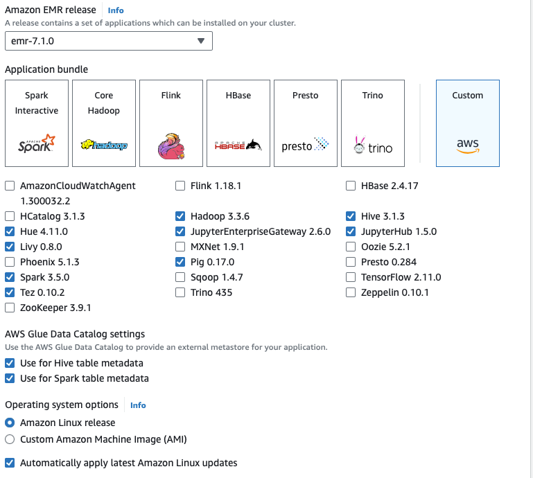

## Apache Software for Data Engineers 

When creating an EMR cluster you will need to select what application bundle to include/install. 

Research these components:

* Apache Spark
* Apache Hadoop
* Apache Pig
* Apache Hue
* Apache Tez
* Apache Hive
* Apache Zeppelin
* Apache Trino
* Apache Phoenix

