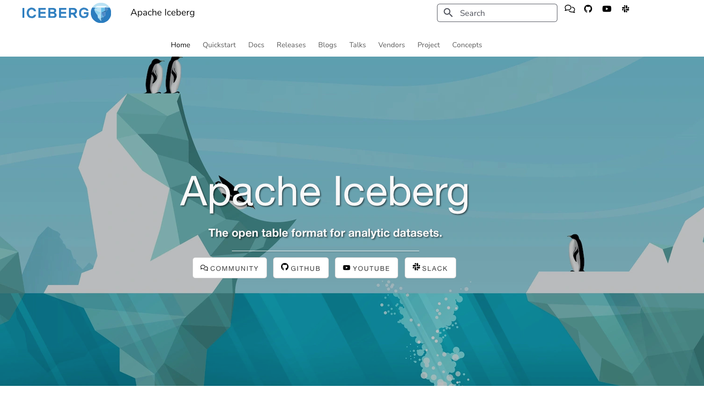
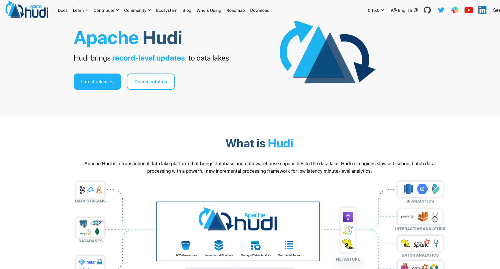
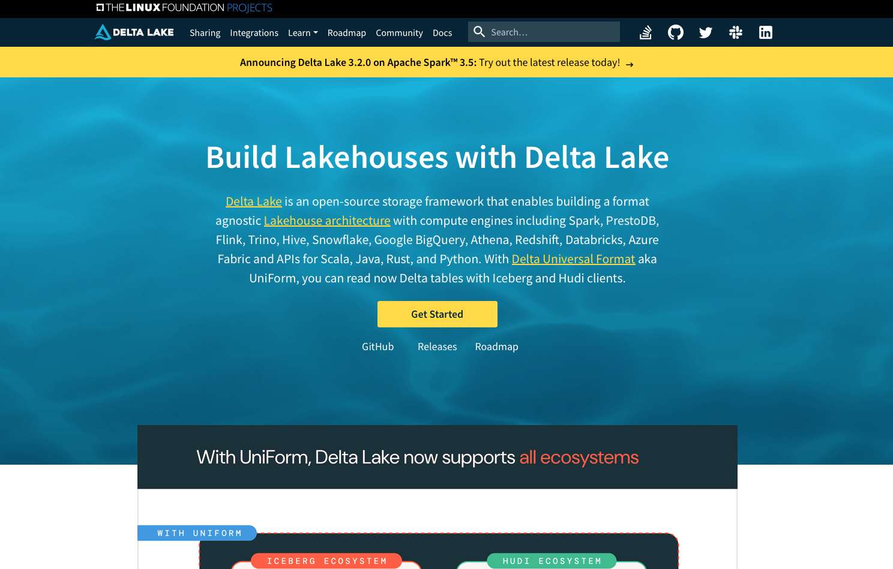
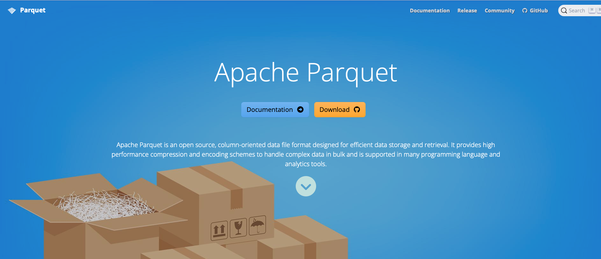

### In-Class Research Activity: Understanding Advanced Data Lake Formats

#### Objective

To explore and understand the features, benefits, and use cases of Parquet, Delta Lake, Hudi, and Iceberg through research and collaborative discussion.

#### Activity Steps

1. Research the following File formats and frameworks.
   - Parquet
   - Delta Lake
   - Hudi
   - Iceberg
2. Capture the following information: 

​		Key features and capabilities.

​		Benefits and limitations.

​		Common use cases and scenarios.

​		Comparisons with other formats

3. Which of these file formats are supports on AWS? Which ones can be stored on Amazon S3?

