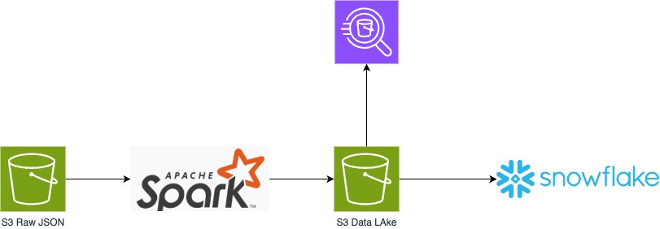
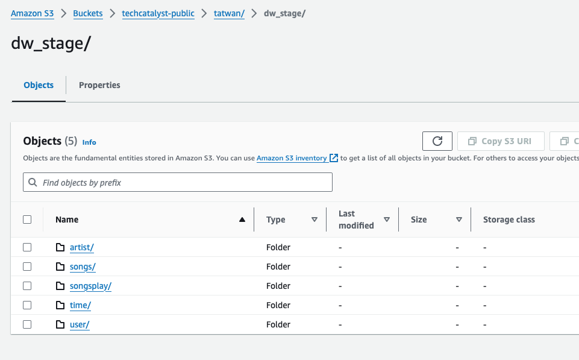

## Project: Million Song Data Lake and Data Warehouse

#### Introduction

A music streaming startup, Sparkify, has grown their user base and song database and want to move their processes and data onto the cloud. Their data resides in S3, in a directory of JSON logs on user activity on the app, as well as a directory with JSON metadata on the songs in their app.

As their data engineer, you are tasked with building an ETL pipeline that extracts their data from S3, stages them in a Data Lake, and transforms data into a set of dimensional tables (in Snowflake) for their analytics team to continue finding insights in what songs their users are listening to. You'll be able to test your database and ETL pipeline by running queries given to you by the analytics team from Sparkify and compare your results with their expected results.

#### Project Description

In this project, you'll apply what you've learned about AWS S3 Data Lakes, Snowflake Data warehouses,  and Databricks/Spark to build an ETL pipeline for a database hosted on Snowflake. 

To complete the project, you will need to extract data from S3 source (RAW JSON files), create a Data Lake in S3 for storing the data as Parquet files after transformation (aka staging area), then load the data from the Data Lake into tables on Snowflake after you execute the necessary SQL statements that create the analytics tables from these staging tables.



You'll be working with two datasets that reside in S3. Here are the S3 links for each:

- Song data: `s3://techcatalyst-public/song_data`
- Log data: `s3://techcatalyst-public/log_data`

Log data json path example: `s3://techcatalyst-public/log_data/2018-11-01-events.json`

# Song Dataset

The first dataset is a subset of real data from the [Million Song Dataset](http://millionsongdataset.com). Each file is in JSON format and contains metadata about a song and the artist of that song. The files are partitioned by the first three letters of each song's track ID. For example, here are filepaths to two files in this dataset.

```
song_data/A/B/C/TRABCEI128F424C983.json
song_data/A/A/B/TRAABJL12903CDCF1A.json
```

And below is an example of what a single song file, TRAABJL12903CDCF1A.json, looks like.

```json
{"num_songs": 1, "artist_id": "ARJIE2Y1187B994AB7", "artist_latitude": null, "artist_longitude": null, "artist_location": "", "artist_name": "Line Renaud", "song_id": "SOUPIRU12A6D4FA1E1", "title": "Der Kleine Dompfaff", "duration": 152.92036, "year": 0}
```

# Log Dataset
The second dataset consists of log files in JSON format generated by this [event simulator](https://github.com/Interana/eventsim) based on the songs in the dataset above. These simulate app activity logs from an imaginary music streaming app based on configuration settings.

The log files in the dataset you'll be working with are partitioned by year and month. For example, here are filepaths to two files in this dataset.
```bash
log_data/2018/11/2018-11-12-events.json
log_data/2018/11/2018-11-13-events.json
```

And below is an example of what the data in a log file, 2018-11-12-events.json, looks like.


## Schema for Song Play Analysis

Using the song and event datasets, you'll need to create a star schema optimized for queries on song play analysis. This includes the following tables.

##### Fact Table

1. songplays - records in event data associated with song plays i.e. records with page `NextSong`
   - *songplay_id, datetime_id, user_id, level, song_id, artist_id, session_id, location, user_agent*

##### Dimension Tables

1. users - users in the app
   - *user_id, first_name, last_name, gender, level*
2. songs - songs in music database
   - *song_id, title, artist_id, year, duration*
3. artists - artists in music database
   - *artist_id, name, location, lattitude, longitude*
4. time - timestamps of records in **songplays**  broken down into specific units
   - datetime, *start_time, hour, day, week, month, year, weekday*

**Example DDL**

```sql
create TRANSIENT TABLE TECHCATALYST_DE.TATWAN.SONGS_DIM (

);

create TRANSIENT TABLE TECHCATALYST_DE.TATWAN.USER_DIM (

);

create TRANSIENT TABLE TECHCATALYST_DE.TATWAN.TIME_DIM (

);

create  TRANSIENT TABLE TECHCATALYST_DE.TATWAN.ARTIST_DIM (

);

create TRANSIENT TABLE TECHCATALYST_DE.TATWAN.SONGPLAYS_FACT (

);


```


## Project Template

To get started with the project, go to the workspace on the next page, where you'll find the project template. You can work on your project and submit your work through this workspace.

Alternatively, you can download the template files in the Resources tab in the classroom and work on this project on your local computer.

The project template includes:

* Databricks dbc file 

## Project Steps

Below are steps you can follow to complete each component of this project.

#### Create Table Schemas

1. Design schemas for your fact and dimension tables 
2. Write a SQL `CREATE TRANSIENT TABLE ` statement for each of these target tables in  Snowflake. Make sure they are `TRANSIENT` tables and in your own **SCHEMA**. 
3. Write the scripts in Snowflake to COPY the data from S3 in Parquet format into the final target tables in Snowflake

#### Build ETL Pipeline

1. Implement the logic  to load data from S3 (t`echcatalyst-public/song_data` and `techcatalyst-public/log_data)`  to **staging area in S3**  (`techcatalyst-public/<yourname>/dw_stage/<yourfiles>`).



2. Validate the Data in the ``techcatalyst-public/dw_stage/<yourname>/<subfolder-subject>/<yourfiles>`` using **Athena** to ensure you have the expected row count per table. For example `techcatalyst-public/dw_stage/tatwan/artist/` , ``techcatalyst-public/dw_stage/tatwan/songs/``, `techcatalyst-public/dw_stage/tatwan/time/` ..etc
3. Implement the logic to load data from staging location in S3 into the analytics tables in Snowflake. 
   1. Create Staging Tables then COPY INTO the tables you have created.

#### Document Process

Here's a [guide](https://www.markdownguide.org/basic-syntax/) on Markdown Syntax. You will need to publish the Markdown report to your GitHub repo.

Do the following steps in your `README.md` file.

1. Show the DDL scripts (CREATE statements for each Target Table)
2. Update the initial Diagram “as needed/if needed” to better describe your overall solution architecture 
3. Discuss the purpose of the Data Lake, and Data Warehouse in context of the startup, Sparkify, and their analytical goals.
4. State and justify your database schema design and ETL pipeline.
5. Summarize your process
6. [Optional] Provide example queries and results for song play analysis.


> REMINDER: Do not include your AWS access keys in your code when sharing this project!


