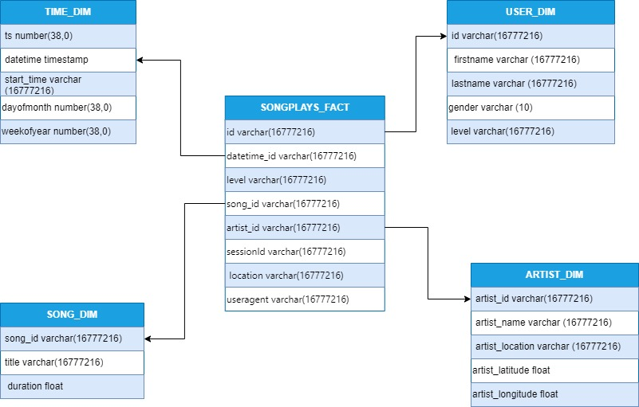

## Min Project Data Lake and DW Student Showcase

* Nityasriya Patturi
* Isabella Recine

https://github.com/sriyapatturi/Mini-ETL-Snowflake-Spark-Patturi

#### [Gina Mastrorilli Solution Page](https://github.com/gmast-17/techcatalyst-de-GM/tree/main/activities/week5/Mini_Project%20)

#### [Ben Combs Solution Page](https://github.com/bencombsHIG/Sparkify-ETL)

#### [Alina Baby Solution Page](https://github.com/alina-hartford/techcatalyst-de-AB/tree/main/activities/week5/miniProject)

#### [Samee Malik](https://github.com/Smalik45/TechCat_Sam_DE/tree/main/Activities/mini%20project)

#### [Peter Alonzo Solution Page](https://github.com/peteralonzo/techcatalyst-de/tree/main/Week5-ETL-Project)

#### [Joseph Cocozza Solution Page](https://github.com/JC05267/tech-cat-learning/tree/master/learning/in_class/mini_project_data_lake_and_dw)

#### [Kaitlyn Borski](https://github.com/kaitlynborski/tecgcatalyst-kaitlyn/tree/main/Lab%205%3A%20Million%20Song%20Data%20Warehouse)

#### [Zayd Ghaffar Solution Page](https://github.com/ZaydGhaffar123/techcat-data-zayd/tree/main/MiniProject)

#### [Aryan Zodge Solution Page](https://github.com/aryan-zodge-thehartford/techcatalyst-de/tree/main/MiniProject)

#### [Jason Juncker Solution Page](https://github.com/jasonjuncker/data-engineering-tech-cat/tree/main/wk5-lab)

#### [Nithila Annadurai](https://github.com/nithilannadurai/techcatalyst-de/tree/main/miniproject)

#### [Andy Amos Mensah](https://github.com/andythehart/techcatalyst-DE-andy/tree/main/million-song-project)

