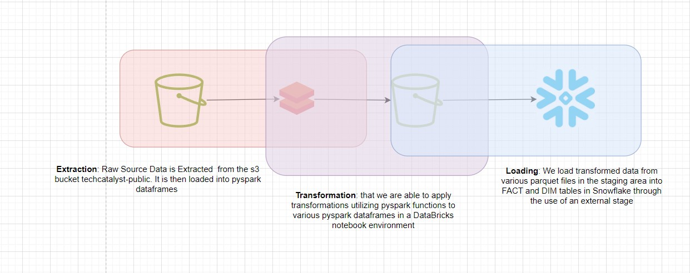
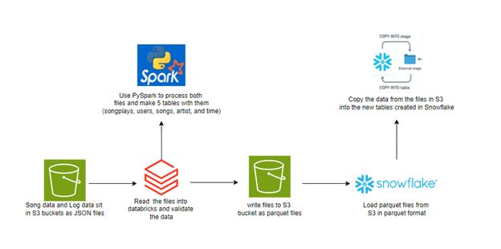

# Min Project Data Lake and DW 

* [Nityasriya Patturi](#Nityasriya-Patturi)
* [Isabella Recine](#Isabella-Recine)
* [Gina Mastrorilli ](#Gina-Mastrorilli )
* [Ben Combs](#Ben-Combs)
* [Alina Baby](#Alina-Baby)
* [Samee Malik](#Samee-Malik)
* [Peter Alonzo](#Peter-Alonzo)
* [Joseph Cocozza](#Joseph-Cocozza)
* [Kaitlyn Borski](#Kaitlyn-Borski)
* [Zayd Ghaffar](#Zayd-Ghaffar)
* [Aryan Zodge](#Aryan-Zodge)
* [Jason Juncker](#Jason-Juncker)
* [Nithila Annadurai](#Nithila-Annadurai)
* [Andy Amos Mensah](#Andy-Amos-Mensah)

----

## Student Showcase

### Nityasriya Patturi
[GitHub Profile](https://github.com/sriyapatturi/Mini-ETL-Snowflake-Spark-Patturi)

### Isabella Recine
[GitHub Profile]((https://github.com/isabella-recine/Techcatalyst-de-Isabella/blob/main/Activities/Week%205/Mini%20Project/ETL%20PRocess.md))

### Gina Mastrorilli
[GitHub Profile]((https://github.com/gmast-17/techcatalyst-de-GM/tree/main/activities/week5/Mini_Project%20))

### Ben Combs
[GitHub Profile]((https://github.com/bencombsHIG/Sparkify-ETL))

### Alina Baby
[GitHub Profile]((https://github.com/alina-hartford/techcatalyst-de-AB/tree/main/activities/week5/miniProject))

### Samee Malik
[GitHub Profile]((https://github.com/Smalik45/TechCat_Sam_DE/tree/main/Activities/mini%20project))

### Peter Alonzo
[GitHub Profile]((https://github.com/peteralonzo/techcatalyst-de/tree/main/Week5-ETL-Project))

### Joseph Cocozza
[GitHub Profile]((https://github.com/JC05267/tech-cat-learning/tree/master/learning/in_class/mini_project_data_lake_and_dw))

### Kaitlyn Borski
[GitHub Profile]((https://github.com/kaitlynborski/tecgcatalyst-kaitlyn/tree/main/Lab%205%3A%20Million%20Song%20Data%20Warehouse))

### Zayd Ghaffar
[GitHub Profile]((https://github.com/ZaydGhaffar123/techcat-data-zayd/tree/main/MiniProject))

### Aryan Zodge
[GitHub Profile]((https://github.com/aryan-zodge-thehartford/techcatalyst-de/tree/main/MiniProject))

### Jason Juncker
[GitHub Profile]((https://github.com/jasonjuncker/data-engineering-tech-cat/tree/main/wk5-lab))

### Nithila Annadurai
[GitHub Profile]((https://github.com/nithilannadurai/techcatalyst-de/tree/main/miniproject))

### Andy Amos Mensah
[GitHub Profile]((https://github.com/andythehart/techcatalyst-DE-andy/tree/main/million-song-project))

