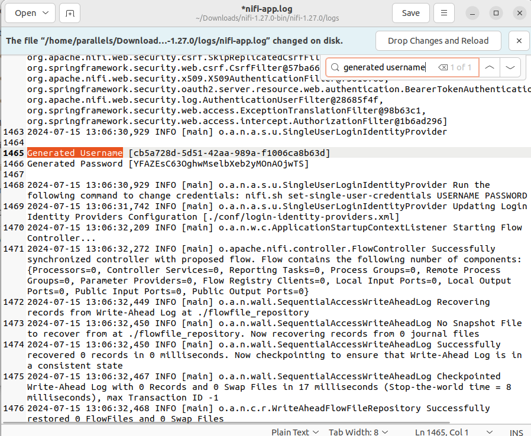

# Apache NiFi

### Download

https://nifi.apache.org/download/

Download the Binary NiFi Standard 1.27.0


Download the `nigi-1.27.0-bin.zip` file


Then extract the files inside


In the terminal run the following command to install Java

```shell
 sudo apt-get install openjdk-21-jdk
```

Once installed. Navigate to your `nifi` folder for example `cd Download/nifi-1.27.0/nifi-1.27.0` and run the `bin/nifi.sh start`


Go to the following URL

```
https://localhost:8443/nifi
```

If you see a warning you can click Advanced and then click Accept the Risk and Continue. 


For the User and Password got to he nifi folder, and find the log folder


Open the `nifi-app.log` file


Search in the file for `Generated Username`



Use the provided Username and Password to login to the NiFi Web Portal.

You will then see the main NiFi canvas


---

## Lab  - Build

Create a folder in Desktop called input-files and place the `sample1.txt` file inside. 

* Create a `GetFile` Processor to read from the input-files folder 

* You will use the `PutS3Object` to write the files to S3. You should write to `techcatalyst-public/nifi/<yourname>/raw/`

  * The bucket name is: `techcatalyst-public`
  * The file name is: `nifi/tatwan/raw/${filename}`
  * Add AWS Credentials Service - click create
  * 
  * Then go to the service and add your credentials 

  

Once done, enable the service


## Lab - Execution

* Run the first Processor (GetFile). 


Notice there is one item in Queue 


Run the PutS3Object now. Verify the files has been written in S3


And check the `input-files` folder now. 

It is Empty. The file has been migrated. The default `keep source file` option is set to False so it will move the file and not keep a local copy. 


And validate the file is in S3


Now move both `sample3.txt` and `sample4.txt` files into he `input-files` folder 


