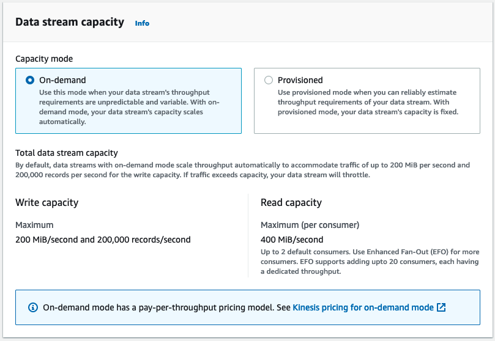
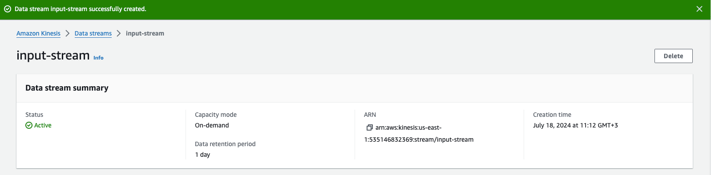

# Real-Time Data Processing with AWS Kinesis and Spark Stream

In this tutorial, we will explore the powerful combination of AWS Kinesis Data Streams and Databricks to implement a real-time data processing pipeline. This hands-on guide will walk you through simulating a data stream, processing the data with PySpark in Databricks (Apache Spark), and storing the processed data in a Delta table. By the end of this tutorial, you will have a solid understanding of how to handle real-time data streams and perform transformations before persisting the data for analysis.

### Key Components

1. **AWS Kinesis Data Streams**:
   - Kinesis Data Streams is a scalable and durable real-time data streaming service provided by AWS.
   - We will use Kinesis to collect and stream real-time data.
2. **Simulating a Data Stream**:
   - We will simulate streaming data by writing Python code that pushes 5 records to Kinesis every few seconds.
   - This simulation will help us understand how to produce data into a Kinesis stream.
   - File `AWS_Kinesis_Example_Producer.ipynb`
3. **Databricks and PySpark**:
   - Databricks is a unified data analytics platform that provides support for Spark.
   - We will use Databricks to read data from Kinesis, process it with PySpark, and write the results to a Delta table.
   - File `Spark Streaming Notebook.dbc`
4. **Delta Lake**:
   - Delta Lake is an open-source storage layer that brings ACID transactions to Apache Spark and big data workloads.
   - We will use Delta Lake to store the processed data efficiently.
   - `Spark Streaming Notebook.dbc`


# Tutorial Outline

## Step 1: Create your Kinesis Data Stream


Click **Create data stream**

1. Give you stream a name. You will be referencing that name throughout. For example, I am using `input-stream`.

​	Amazon Kinesis Data Streams currently have two capacity modes: provisioned and on-demand. In this section we will introduce both modes and 	provide guidance on when each might be appropriate in your workload.

​	

​	Here is a summary between the two modes. 

| On-Demand                                                    | Provisioned                                 |
| ------------------------------------------------------------ | ------------------------------------------- |
| New streams with unknown traffic                             | Predictable traffic                         |
| Unpredictable traffic                                        | Traffic is consistent                       |
| Prefer the ease of hands-free management                     | Need tight control of shards                |
| Lower cost of ownership                                      | Predictable costs                           |
| Limited to 200 MB/s of write and 400 MB/s of read throughput | No capacity limits for a provisioned stream |

2. Keep the default On-demand


3. Click **Create data stream**

When finally created, you should see a status **Active** on the stream




## Step 2: Simulating a Data Stream with Python

In the following code, you can use Google Colab. Make sure to create your `aws.cfg` file and upload it to Colab

`aws.cfg` example:

```
[AWS]
aws_access_key_id = youraccesskey
aws_secret_access_key = yoursecretkey
region_name=us-east-1
```

Make sure to change the values to match yours.

Please refer to the `AWS_Kinesis_Example_Producer.ipynb` and open it in Colab.

We will start by simulating a real-time data stream. A Python script will generate taxi ride records and push them to a **Kinesis data stream**. The script will:

1. Generate a set of taxi ride data records.
2. Encode the data as JSON and push 5 records to the Kinesis stream every few seconds.

In the script provided we have a `produce` function 

```python
def produce(stream_name, data, partition_key):
    try:
        # Convert timestamps to strings
        for key in data:
            if isinstance(data[key], pd.Timestamp):
                data[key] = data[key].isoformat()
                # using the put_record method to push the stream
        response = kinesis_client.put_record(
            StreamName=stream_name,
            Data=json.dumps(data),
            PartitionKey=partition_key
        )
        return response
    except Exception as e:
        print(f"Error producing record: {e}")
```

In the function we are using the `put_record` method

**Key Components of `put_record`**

1. **StreamName**: The name of the Kinesis data stream where the record will be written.
2. **Data**: The actual data payload to be sent to the Kinesis stream. This data must be in bytes, so you typically encode your data to bytes (e.g., using UTF-8 encoding).
3. **PartitionKey**: A key used to determine which shard in the stream the data record is assigned to. This ensures that records with the same partition key are written to the same shard.
4. **SequenceNumberForOrdering (optional)**: Guarantees strictly increasing sequence numbers for records within the same partition key.

## Step 3: Reading and Processing the Stream with PySpark

Please refer to the `Spark Streaming Notebook.dbc` and upload to your Databricks workspace

The notebook will:

1. Define the **schema** of the incoming JSON data.
2. Read the data stream from Kinesis.
3. Perform basic transformations, such as adding new columns for year, month, day, and hour.
4. Print the data in each micro-batch for verification.

In the code we defined the schema using **StructType** and **StructField**:

```python
schema = StructType([
    StructField("VendorID", StringType(), True),
    StructField("tpep_pickup_datetime", TimestampType(), True),
    StructField("tpep_dropoff_datetime", TimestampType(), True),
    StructField("passenger_count", DoubleType(), True),
    StructField("trip_distance", DoubleType(), True),
    StructField("RatecodeID", StringType(), True),
    StructField("store_and_fwd_flag", StringType(), True),
    StructField("PULocationID", StringType(), True),
    StructField("DOLocationID", StringType(), True),
    StructField("payment_type", StringType(), True),
    StructField("fare_amount", DoubleType(), True),
    StructField("extra", DoubleType(), True),
    StructField("mta_tax", DoubleType(), True),
    StructField("tip_amount", DoubleType(), True),
    StructField("tolls_amount", DoubleType(), True),
    StructField("improvement_surcharge", DoubleType(), True),
    StructField("total_amount", DoubleType(), True),
    StructField("congestion_surcharge", DoubleType(), True),
    StructField("Airport_fee", DoubleType(), True)
])

```

1. **`StructType`**:
   - `StructType` is a class that represents the **schema** of a DataFrame. It is a collection of `StructField` objects.
2. **`StructField`**:
   - Each `StructField` defines a single column in the DataFrame.
   - `StructField(name, dataType, nullable)` : It takes three arguments:
     - `name`: The name of the column.
     - `dataType`: The data type of the column (e.g., `StringType()`, `TimestampType()`, `DoubleType()`).
     - `nullable`: A boolean flag indicating whether the column can contain null values (`True` means the column can contain null values).


**Why are we defining the schema?**

Defining the schema explicitly is useful for several reasons:

- **Data Validation**: Ensures that the incoming data conforms to the expected structure and types.
- **Performance**: Improves performance by avoiding schema inference at runtime.
- **Error Handling**: Helps in early detection of schema mismatches or data type issues.


Here is a screen shot when the stream job:


## Step 4: Writing the Processed Data to Delta Lake

Finally, the processed data will be written to a Delta table stored in an S3 bucket. This step ensures that the data is stored efficiently and can be queried for further analysis. The data will be partitioned by year, month, day, and hour to optimize query performance and manageability.

Screen shot after reading the Delta Lake data to confirm output:


Example how the streams are being stored/partitioned by year, month, day, and hour.


---

# Discussion Points and Questions (Research Time)

**Instructions**

As a Data Engineering consultant, streaming data is a hot topic, and your client heard about real-time data, near-real time data, batch processing but they have no clue what they mean and what they really need. Below are questions your team captured from their initial kick-off meeting with the client, and asked you to do research so they can return with proper answers on their next visit. They are relying on you to not lose this deal given the high profile of this client and the potential reward of winning the project. 

* You will need to write a Markdown `README.md` file and answer to the questions below. 
* You will need to include a **architecture diagram** of what you just accomplished in this tutorial. But do it in a way that your team can use to **present** to their prospect client to **illustrate** what a sample architecture would look like with AWS, Spark …etc. 

To deepen your understanding of real-time data processing with AWS Kinesis, Databricks, and Delta Lake, consider the following discussion points and questions:

1. **Real-Time Data Streaming Concepts**:
   - What are the key differences between real-time and batch processing? What are some use cases where real-time processing is essential?
   - How does Kinesis Data Streams compare to other streaming platforms such as Apache Kafka ?
2. **Comparing Stream Processing Frameworks**:
   - Compare PySpark with other stream processing frameworks like Apache Flink, Apache Storm, and Kafka Streams. What are the strengths and weaknesses of each?
3. **AWS Kinesis**:
   - What are the key components of AWS Kinesis, and how do they interact (Kinesis Data Streams, Kinesis Data Firehose, Kinesis Data Analytics)?
   - Explore the different types of sharding in Kinesis and how they impact data partitioning and throughput.
4. **Data Processing with PySpark**:
   - How do window functions work in PySpark, and how can they be used to process streaming data (e.g., sliding windows, tumbling windows)?
   - Investigate other PySpark transformations and actions that could be useful in real-time data processing scenarios.
5. **Delta Lake and Data Storage**:
   - What are the benefits of using Delta Lake for data storage compared to traditional data lakes or data warehouses?
   - How do ACID transactions in Delta Lake ensure data reliability and consistency in real-time data processing?
6. **Partitioning Strategy**:
   - Why is partitioning by year, month, day, and hour a good practice for storing time-series data? What are some other partitioning strategies that could be used based on different use cases?
   - Discuss the trade-offs between fine-grained and coarse-grained partitioning in terms of query performance and storage efficiency.
7. **Performance and Scalability**:
   - How does the scalability of AWS Kinesis affect the performance of your real-time data pipeline? What are some strategies to handle high throughput and large data volumes?
   - What are the potential bottlenecks in a real-time data processing pipeline, and how can they be mitigated?
8. **Error Handling and Monitoring**:
   - What are some common error handling strategies for real-time data streams? How would you implement retry logic or dead-letter queues in your pipeline?
   - Discuss the importance of monitoring and logging in real-time data pipelines. What tools and techniques can be used to monitor the health and performance of your streaming applications?
9. **Use Cases and Applications**:
   - Explore some real-world use cases of real-time data processing in different industries (e.g., finance, healthcare, IoT, e-commerce).
   - How can real-time analytics and decision-making improve business operations and customer experiences?

