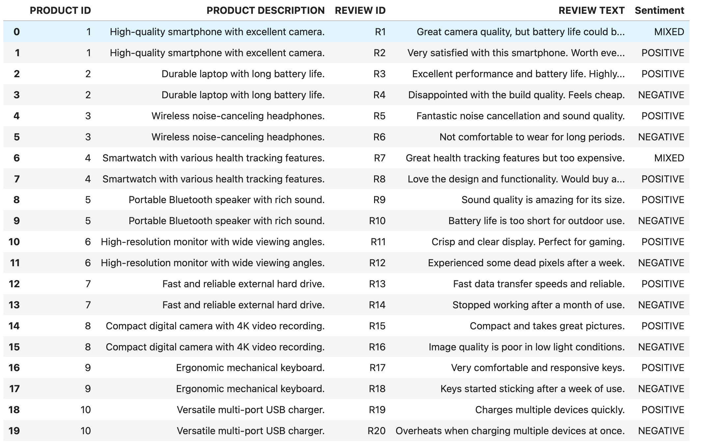
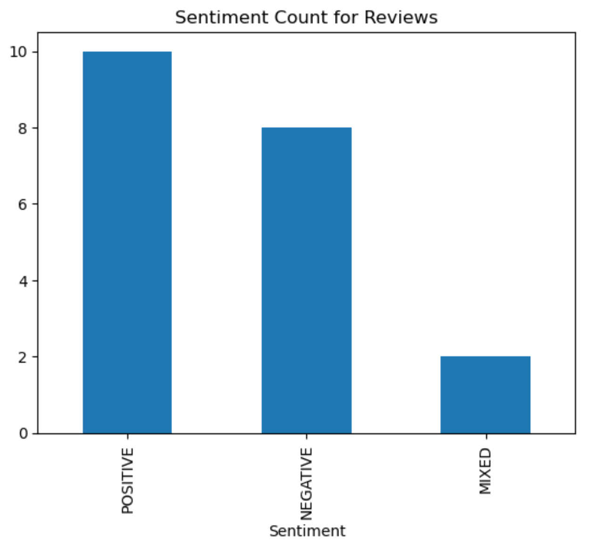
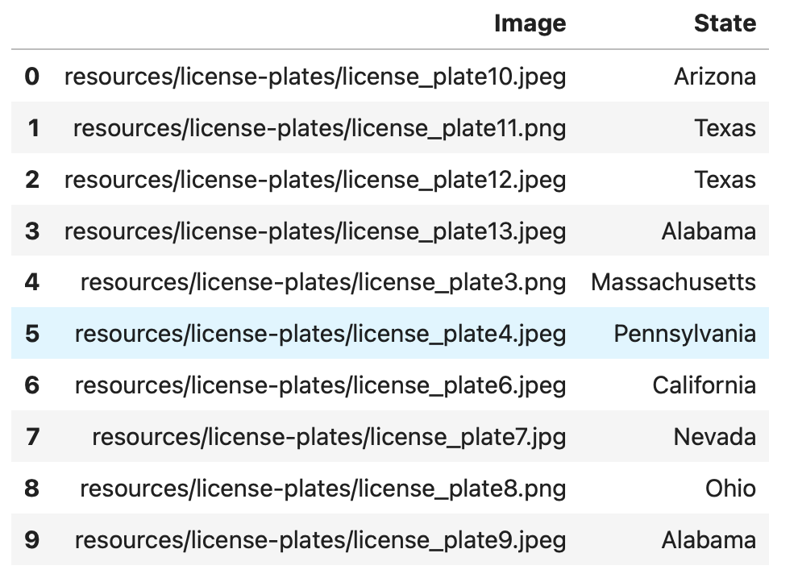
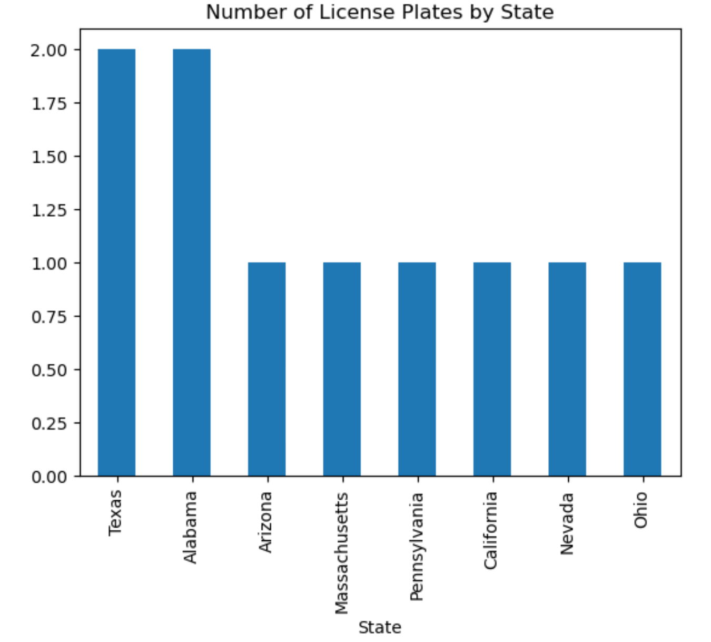

# Utilize AWS AI Services (Comprehend and Rekognition)

## Sentiment Analysis

There are two CSV datasets: `product` and `review`. The client wants to combine the datasets and add a sentiment column. Finally, they want a quick summary on the Sentiment counts displayed as Bar Graph using Python.

What is the overall impression/sentiment for their products?

## License Plate States

The client has difference images of licenses plates from different states. They want to get a summary counts of license plates by state. They also want to create a table (DataFrame) that labels each image with the proper state.

