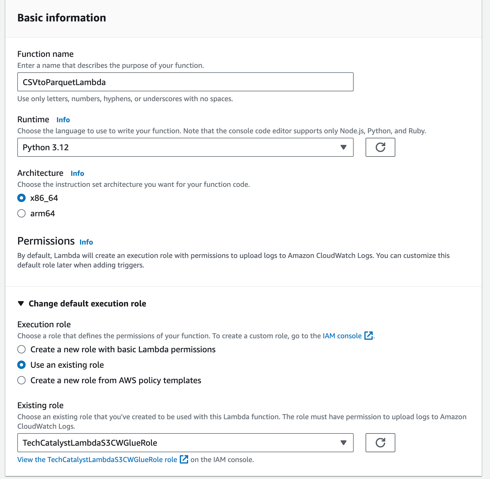
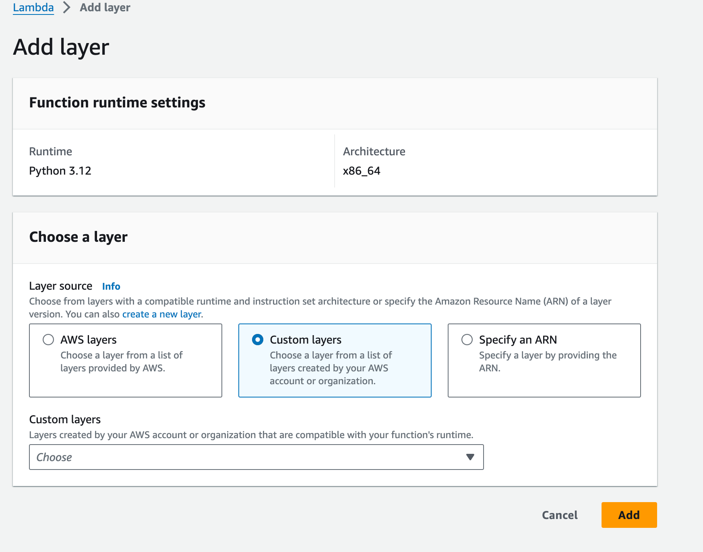
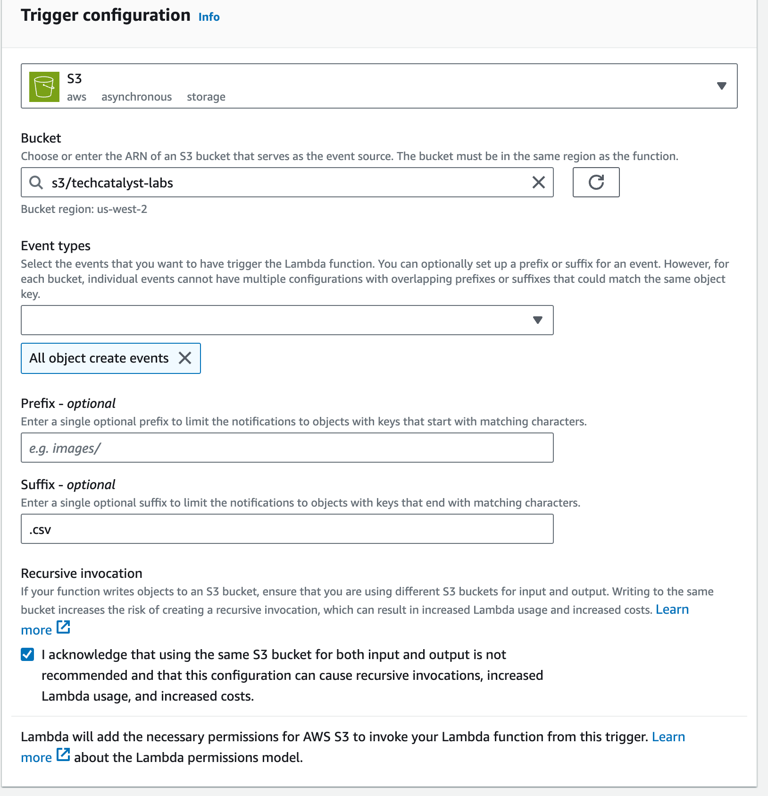
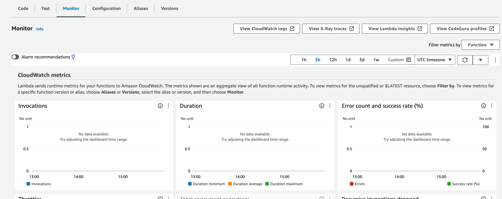
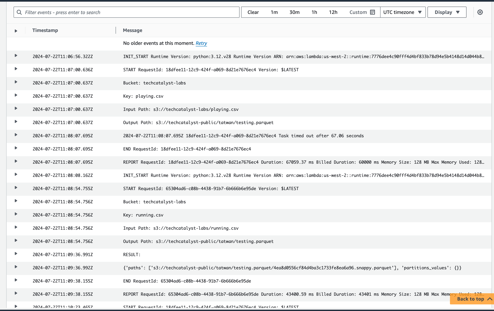

# Hands-on – triggering an AWS Lambda function when a new file arrives in an S3 bucket


In the hands-on activity we’re going to configure an S3 bucket to automatically trigger a Lambda function whenever a new file is written to the bucket. In the Lambda function, we’re going to make use of an open-source Python library called **AWS SDK for pandas**, created by AWS Professional Services to simplify common ETL tasks when working in an AWS environment. We’ll use the AWS SDK for pandas library to convert a CSV file into Parquet format and then update AWS Glue Data Catalog.

Converting a file into Parquet format is a common transformation in order to improve analytic query performance against our data. This can either be done in bulk (such as by using an AWS Glue job that runs every hour to convert files received in the past hour), or it can be done as each file arrives, as we are doing in this hands-on exercise. A similar approach can be used for other use cases, such as updating a `total_sales` value in a database as files are received with daily sales figures from a company’s retail stores across the world. 

## Creating an IAM policy and role for your Lambda function

In this section, we will create a Lambda function to be triggered every time a new file is uploaded to our landing zone S3 bucket. The Lambda function will process the file and write out a new version of the file to a target bucket (our clean zone S3 bucket). 

For this to work, we need to ensure that our Lambda function has the following permissions:

1. Read our source S3 bucket 
2. Write to our target S3 bucket 
3. Write logs to Amazon CloudWatch.
4. Access to all Glue API actions (for a later activity).

To create a new AWS IAM role with these permissions, follow these steps:

1. In the search bar at the top of the AWS console, search for and select the **IAM**service, and in the left-hand menu, select **Policies** and then click on **Create policy**.

2. By default, the **Visual editor** tab is selected, so click on **JSON** to change to the **JSON** tab.

3. Provide the JSON code from the following code blocks, replacing the boilerplate code. 

   Here is how mine looks like which you will need to adjust using your bucket name:

   ```TechCatalystLambdaS3CWGluePolicy```

   ```json
   {
   	"Version": "2012-10-17",
   	"Statement": [
   		{
   			"Effect": "Allow",
   			"Action": [
   				"logs:PutLogEvents",
   				"logs:CreateLogGroup",
   				"logs:CreateLogStream"
   			],
   			"Resource": "arn:aws:logs:*:*:*"
   		},
   		{
   			"Effect": "Allow",
   			"Action": [
   				"s3:*"
   			],
   			"Resource": [
   				"arn:aws:s3:::techcatalyst-labs/*",
   				"arn:aws:s3:::techcatalyst-labs",
   				"arn:aws:s3:::techcatalyst-raw/*",
   				"arn:aws:s3:::techcatalyst-raw",
   				"arn:aws:s3:::techcatalyst-transformed/*",
   				"arn:aws:s3:::techcatalyst-transformed",
   				"arn:aws:s3:::techcatalyst-target/*",
   				"arn:aws:s3:::techcatalyst-target",
   				"arn:aws:s3:::techcatalyst-public/*",
   				"arn:aws:s3:::techcatalyst-public"
   			]
   		},
   		{
   			"Effect": "Allow",
   			"Action": [
   				"glue:*"
   			],
   			"Resource": "*"
   		}
   	]
   }
   ```

   

1. Click on **Next Tags** and then **Next: Review**.
2. Provide a name for the policy, such as `<yourname>TechCatalystS3CWGluePolicy`, and then click **Create policy**.
3. In the left-hand menu, click on **Roles** and then **Create role**.
4. For the trusted entity, ensure **AWS service** is selected, and for the service, select **Lambda** and then click **Next: Permissions**. In *step 4* of the next section (*Creating a Lambda function*), we will assign this role to our Lambda function.
5. Under **Attach permissions**, select the policy we just created (for example, ``<yourname>TechCatalystS3CWGluePolicy``) by searching and then clicking the tick box. Then, click **Next**.
6. Provide a role name, such as``<yourname>TechCatalystLambdaS3CWGlueRole`, and click **Create role**.

## Creating a Lambda layer containing the AWS SDK for pandas library

Lambda layers allow your Lambda function to bring in additional code, packaged as a **.zip** file. In our use case, the Lambda layer is going to contain the AWS SDK for pandas Python library, which we can then attach to any Lambda function where we want to use the library.

To create a Lambda layer, do the following:

1. Access the  version of the AWS SDK for pandas library in GitHub at https://github.com/aws/aws-sdk-pandas/releases. Under **Assets**, download the `awswrangler-layer-3.9.0-py3.12.zip` file to your local drive. 
2. Make sure that you are in the Region that you have chosen for performing this activity and the same region as the S3 buckets you created earlier. 
3. In the top search bar of the AWS console, search for and select the **Lambda** service.
4. In the left-hand menu, under **Additional Resources**, select **Layers**, and then click on **Create layer**.
5. Provide a **name** for the layer (for example, `awsSDKpandas390_python312`) and an optional description, and then upload the `.zip` file you downloaded from GitHub. For **Compatible runtimes-optional**, select **Python 3.12**, and then click **Create**. The following screenshot shows the configuration for this step:



By creating a Lambda layer for the AWS SDK for pandas library, we can use AWS SDK for pandas in any of our Lambda functions just by ensuring this Lambda layer is attached to the function.

## Creating a Lambda function

We are now ready to create our Lambda function that will be triggered whenever a CSV file is uploaded to our source S3 bucket. The uploaded CSV file will be converted into Parquet, written out to the target bucket using the AWS SDK for pandas library:

1. In the AWS console, search for and select the **Lambda** service, and in the left-hand menu, select **Functions** and then click **Create function**. 
2. Select **Author from scratch** and provide a **function name** (such as `CSVtoParquetLambda`).
3. For **Runtime**, select **Python 3.12** from the drop-down list.
4. Expand **Change default execution role** and select **Use an existing role**. From the drop-down list, select the role you created in the previous section (such as `<yourname>TechCatalystLambdaS3CWGlueRole`):


1. Do not change any of the **Advanced settings** and click **Create function**.
2. Click on **Layers** in the first box (*Function overview*), and then click **Add a layer**in the **Layers** box.
3. Select **Custom layers**, and from the dropdown, select the AWS SDK for pandas layer you created in a previous step (such as `awsSDKpandas390_python312`). Select the latest version and then click **Add**.



Figure 3.12: Adding an AWS Lambda layer to an AWS Lambda function

1. Scroll down to the **Code Source** section in the Lambda console. You will need to update/complete the following code

   **WHAT IS THIS CODE DOING?**

   ```python
   import boto3
   import awswrangler as wr
   from urllib.parse import unquote_plus
   import json
   
   def lambda_handler(event, context):
       # Get the source bucket and object name from the Lambda event
       for record in event['Records']:
           source_bucket = record['s3']['bucket']['name']
           source_key = unquote_plus(record['s3']['object']['key'])
       
       print(f'Bucket: {source_bucket}')
       print(f'Key: {source_key}')
       
       input_path = f"s3://{source_bucket}/{source_key}"
       print(f'Input Path: {input_path}')
       
       # Define the destination bucket and key
       destination_bucket = #YOUR CODE
     
       output_path = f"s3:// " # COMPLETE THIS PART 
       print(f'Output Path: {output_path}')
       
       # Read the CSV file from S3
       try:
           input_df = wr.s3.read_csv([input_path])
       except Exception as e:
           print("error on read")
           print(e)
       # print(type(input_df))
       
       # Write the DataFrame to Parquet format in the destination S3 bucket
       result = wr.s3.to_parquet(
           df=input_df, 
           path=output_path,
           dataset=True,
           mode="overwrite"
       )
       
       print("RESULT: ")
       print(result)
       
       return {
           'statusCode': 200,
           'body': json.dumps('CSV file converted to Parquet and moved successfully!')
       }
   
   ```

2. Click on **Deploy** at the top of the **Code Source** window

3. Click on the **Configuration** tab (above the **Code Source** window), and on the left-hand side, click on **General configuration**. Click the **Edit** button and modify the **Timeout** to be 1 minute (the default timeout of 3 seconds is likely to be too low to convert some files from CSV into Parquet format). Then, click on **Save**. *If you skip this step, you are likely to get an error when your function runs*. 

## Configuring our Lambda function to be triggered by an S3 upload

Our final task is to configure the Lambda function so that whenever a CSV file is uploaded to our landing zone bucket, the Lambda function runs and converts the file into Parquet format:

1. In the **Function Overview** box of our Lambda function, click on **Add trigger**.
2. For **Trigger configuration**, select the **S3** service from the drop-down list.
3. For **Bucket**, select your landing zone bucket.
4. We want our rule to trigger whenever a new file is created in this bucket, no matter what method is used to create it (**Put**, **Post**, or **Copy**), so select **All object create events** from the list.
5. For **suffix**, enter `.csv`. This will configure the trigger to only run the Lambda function when a file with a `.csv` extension is uploaded to our landing zone bucket.
6. Acknowledge the warning about **Recursive invocation**, which can crop up if you set up a trigger on a specific bucket to run a Lambda function and then you get your Lambda function to create a new file in that same bucket and path. 



1. Click **Add** to create the trigger.
2. Use the test.csv template in the resources folder. And upload it using the Boto3 api (previous activity) 
3. If everything has been configured correctly, your Lambda function will have been triggered and will have written out a Parquet-formatted file to your target S3 bucket 

#### NOTE

If you run into issues you need to read the log files. In this activity you will run into several issues probably an your best option is reading the logs.






 