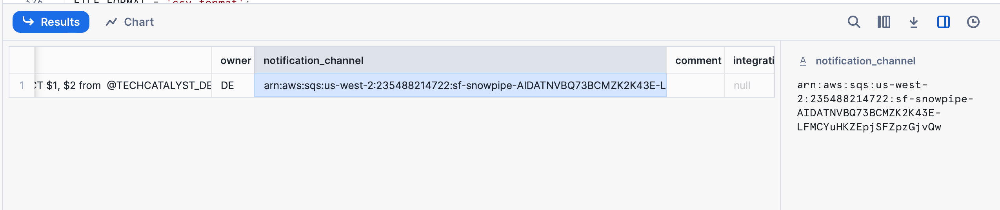
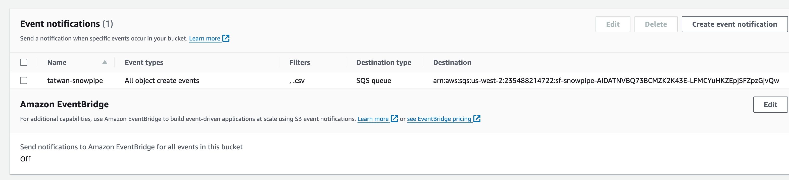
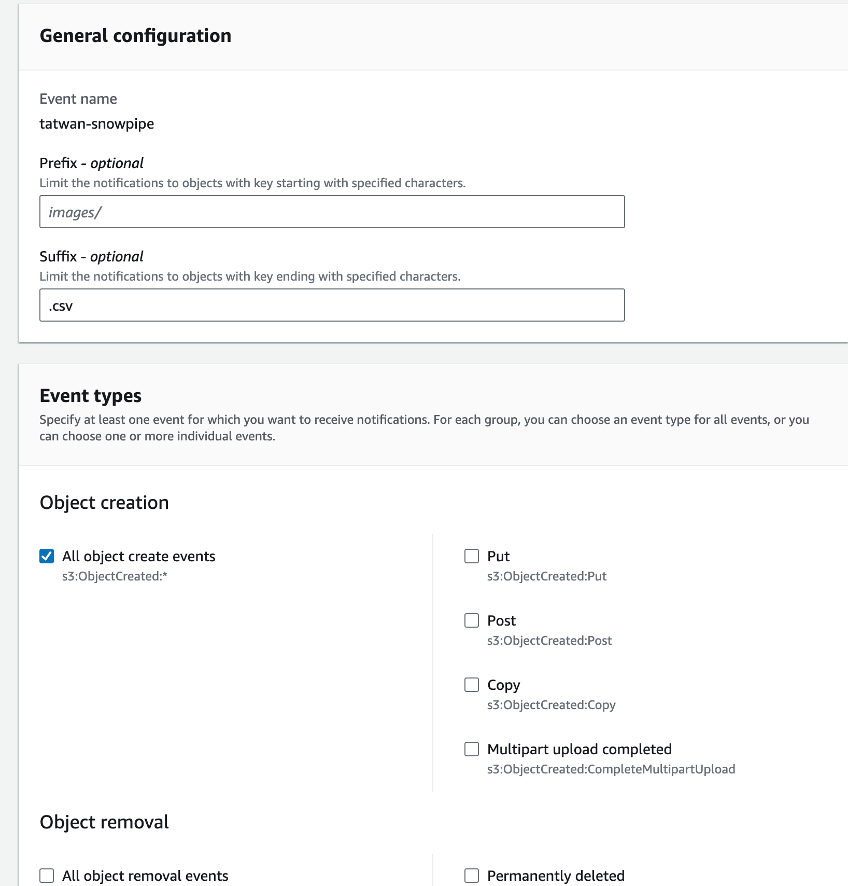
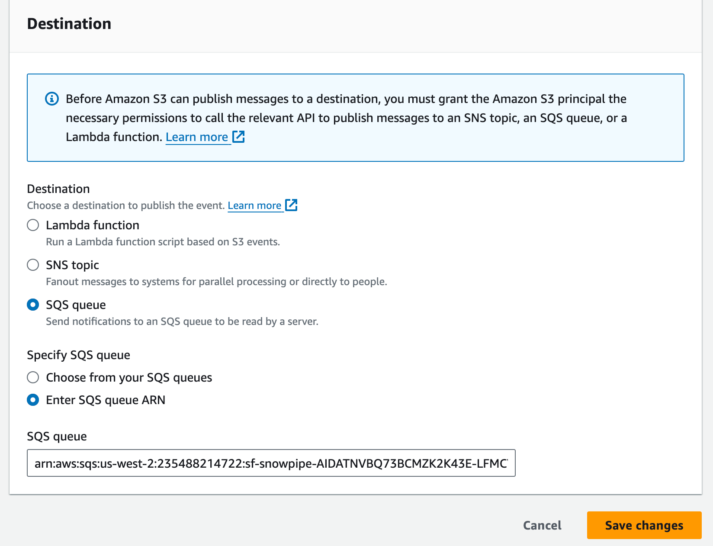

# Automating Snowpipe for Amazon S3

Create a stage as shown pointing to your S3 Bucket

```sql
CREATE OR REPLACE STAGE TECHCATALYST_DE.EXTERNAL_STAGE.AWS_STAGE
        STORAGE_INTEGRATION = s3_int
        URL='s3://techcatalyst-public/tatwan/';
```

Create a CSV file format

```sql
CREATE OR REPLACE FILE FORMAT csv_format
TYPE = 'CSV'
FIELD_OPTIONALLY_ENCLOSED_BY = '"'
SKIP_HEADER = 1;
```

Create a PIPE that uses your stage

```sql
create or replace pipe techcatalyst_de.external_stage.tarek_pipe
auto_ingest = True
as 
copy into techcatalyst_de.tatwan.test
from  @TECHCATALYST_DE.EXTERNAL_STAGE.AWS_STAGE
FILE_FORMAT = 'csv_format';
```

Create your table schema

```sql
create or replace transient table techcatalyst_de.tatwan.test
(
name string,
favnumber number
);
```

Run

```
show pipes;
```

And COPY the ARN 



Go to your S3 bucket on AWS and under Properties click Event Notifications and **Create Event Notification**



Use a `.csv` suffix 

And click “All Object Create Event”



Finally, paste the ARN you just copied from Show Pipes in snowflake 



Test uploading the CSV file. Do note there will be some latency between even trigger and data being copied.

Run a` SELECT *` on your table to check.

