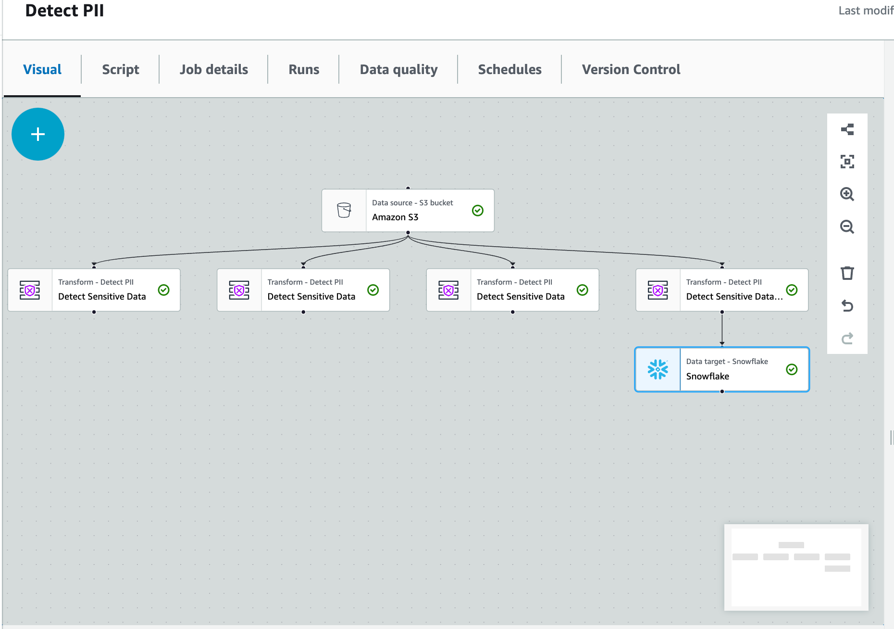

### Instructions for Students: Setting Up AWS Glue Service Role and Using Glue Studio for PII Transformations

#### Objective:

Create a custom AWS Glue service role, apply various PII (Personally Identifiable Information) transformations using AWS Glue Studio, and write the final output to a Snowflake table. You will explore different PII transformation options provided by AWS Glue.

## Steps:

### Part 1: Create AWS Glue Service Role

1. **Create a Custom AWS Glue Service Role:**
   - Open the AWS Management Console.
   - Navigate to the IAM service.
   - Click on “Roles” in the left navigation pane.
   - Click “Create role.”
   - 
2. **Configure the Role:**
   - Select "Glue" from the use case options.
   - Click “Next: Permissions.”
3. **Attach AWS Built-in Policies:**
   - Search for and select the following policies:
     - `AmazonS3FullAccess`
     - `AWSGlueServiceRole`
   - Click “Next: Tags” and then “Next: Review.”
4. **Name the Role:**
   - Enter a name for your role: `TechCatalyst-AWSGlueServiceRoleDefault-<YourName>`
   - Click “Create role.”
5. **Add Inline Policies:**
   - Find the newly created role in the IAM roles list and click on its name to open it.
   - Click “Add inline policy” to add custom permissions.

6. **Create `GlueNotebookPolicy`:**

   - In the JSON tab, paste the following policy:

     ```json
     {
         "Version": "2012-10-17",
         "Statement": [
             {
                 "Effect": "Allow",
                 "Action": "iam:PassRole",
                 "Resource": "arn:aws:iam::535146832369:role/TechCatalyst-AWSGlueServiceRoleDefault-<YourName>"
             }
         ]
     }
     ```

- Replace `<YourName>` with your actual name.
- Click “Review policy.”
- Name the policy (e.g., `GlueNotebookPolicy-<YourName>`) and click “Create policy.”

7. **Create and Attach SecretReadPolicy:** 
   * Click "Add inline policy" again. - Click on the “JSON” tab. 
   * Copy and paste the following JSON and create the policy.

```json
{
    "Version": "2012-10-17",
    "Statement": [
        {
            "Effect": "Allow",
            "Action": "secretsmanager:GetSecretValue",
            "Resource": "arn:aws:secretsmanager:us-east-1:535146832369:secret:snwoflake-tatwan-CLLOG4"
        }
    ]
}
```


8. **Launch AWS Glue Studio:**

- Open the AWS Management Console.
- Navigate to AWS Glue Studio.

9. **Create a New Glue Job:**

- Click on “Jobs” from the left navigation pane.
- Click on “Add job” and select “Visual with a source and target.”

10. **Set Up Source:**

- Choose “S3” as the source type.
- Enter the S3 path: `s3://techcatalyst-raw/sensitive/insurance_pii_data.csv`
- Configure any additional settings if necessary (e.g., file format, delimiter).

11. **Apply PII Transformations:**

- Add a transformation by clicking on “Transform” in the visual editor.
- Select “PII Transform.”


12. **Explore Different PII Transformation Options:**

- Find Sensitive Data in Each Row:
  - Configure the PII transform to detect sensitive data in each row.
  - Explore different sensitivity levels (High and Low).
- Columns Option:
  - Configure the PII transform to detect sensitive data in specific columns.
  - Explore different sensitivity levels (High and Low).
- Include All Available Types (256):
  - Configure the PII transform to include all available PII types (256 types).
  - Explore different sensitivity levels.
- Select Categories:
  - Configure the PII transform to select specific categories of PII data.
  - Explore different sensitivity levels.
- Different Actions (DETECT, REDACT, SHA256_HASH):
  - Configure the PII transform for each action (DETECT, REDACT, SHA256_HASH).
  - Experiment with the settings and observe the differences.

----


13. **Write the Final Output to Snowflake:**

- For the REDACT action, configure the final output to be written to a Snowflake table.
- Refer to the AWS Glue documentation on [connecting to Snowflake](https://docs.aws.amazon.com/glue/latest/dg/aws-glue-programming-etl-connect-snowflake-home.html).


- Create a Snowflake connection string using AWS Secrets Manager. Refer to [this guide](https://docs.aws.amazon.com/secretsmanager/latest/userguide/create_secret.html) to create and manage the secret.
- Configure the Snowflake connection in AWS Glue Studio and specify the target Snowflake table.
  - You will need to create a table schema in Snowflake, for example I called mine`TECHCATALYST_DE.TATWAN.TAXI_REDACTED`





14. **Run the Job:**

- Validate your job settings.
- Click “Run” to start the job.

**15. Verify Results in Snowflake:**

- Log in to your Snowflake account.
- Query the target table to ensure that the data has been correctly written and the PII transformations have been applied as expected.


