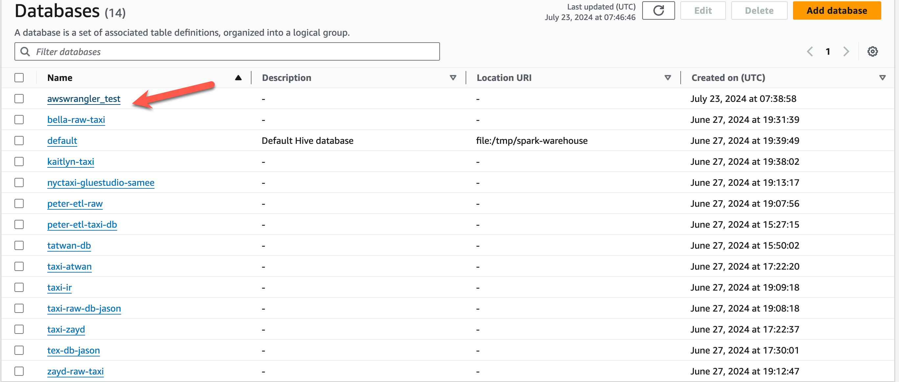
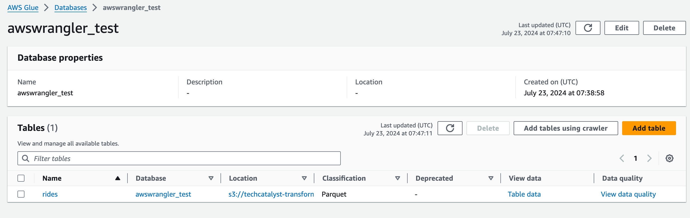
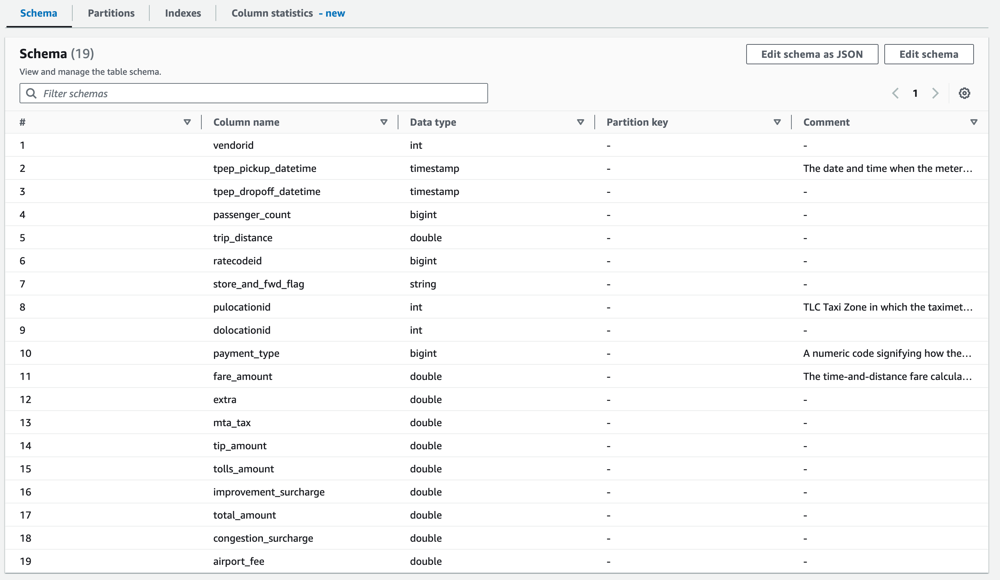
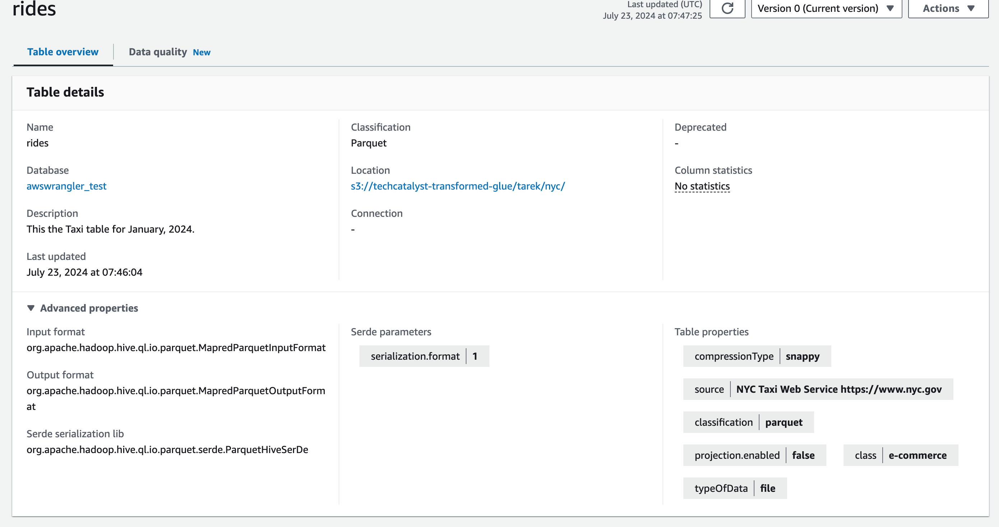
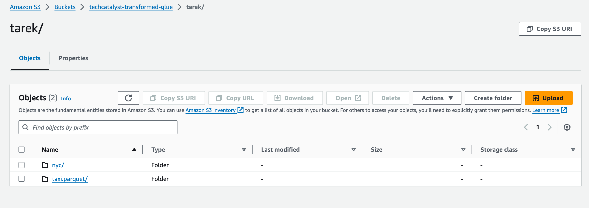

# Introduction to AWS SDK for Pandas (awswrangler)

In this session, we'll explore how to use the AWS SDK for Pandas, also known as `awswrangler`, to simplify interactions with AWS services like S3. This library provides a higher-level interface compared to Boto3, making it easier to perform data engineering tasks directly in Python.

We'll start with a brief refresher on using Boto3 to interact with S3 and then move on to using `awswrangler` to achieve the same tasks more efficiently.

**If you get stuck, there is no better place than reading the documentation which you can find here: https://aws-sdk-pandas.readthedocs.io/en/stable/**

---

### Setting Up Boto3 and Interacting with S3

1. **Import necessary libraries and read AWS credentials:**

   ```python
   import configparser
   import boto3
   import pandas as pd
   
   # Import your credentials from your .cfg file
   # YOUR CODE
   
   aws_access_key = 
   aws_secret_key = 
   ```

2. **Create an S3 client:**

   ```python
   s3 = # YOUR CODE
   ```

3. **List all buckets and get the location of a specific bucket:**

   ```python
   response = # YOUR CODE
   
   
   ```

4. **Create a new bucket:**

   ```python
   bucket_name = 
   # if not us-east-1
   location = 
   
   # YOUR CODE TO CREATE A BUCKET
   s3.
   ```

5. **Upload files using `upload_file` and `put_object`:** A file of your choice

   ```python
   # UPLOAD_FILE CODE
   
   
   #PUT_OBJECT CODE
   
   
   ```

   

### Transition to AWS SDK for Pandas (awswrangler)

1. **Install `awswrangler`:**

   ```python
   !conda install -c conda-forge awswrangler -y
   
   
   ```

2. **Import `awswrangler` and set up default session:**

   ```python
   import awswrangler as wr
   
   boto3.setup_default_session(
       aws_access_key_id=
       aws_secret_access_key=a
       region_name=
   )
   ```

3. **Read data from S3 directly into a Pandas DataFrame:**

   `s3://techcatalyst-raw/yellow_tripdata_2024-01.parquet`

   ```python
   try:
       df = wr.s3.read_parquet # YOUR CODE 
   except Exception as e:
       print('error')
       print(e)
   ```

4. **Inspect the DataFrame:** Check the type (is it a Pandas DataFrame), DataFrame Shape, print first few rows, inspect with info 

   ```python
   # YOUR CODE
   ```

5. **Write DataFrame to S3 as a Parquet file:**

   ```python
   # complete the code
   wr.s3.to_parquet(
       df= 
       path=
       dataset=True
       mode=
   )
   ```

6. **Work with AWS Glue Catalog:**

   - **List databases:** Note this will be showing Glue databases based on the region you specified when you created the session 

     ```python
     databases = wr.catalog.databases()
     print(databases)
     ```

   - **Create a new database if it doesn't exist:** Call it `<yourname>-awswrangler_test` 

   - REPLACE <yourname> with actual value

     ```python
     if "`<yourname>-awswrangler_test`" not in databases.values:
         # YOUR CODE
         print(wr.catalog.databases())
     else:
         print("Database awswrangler_test already exists")
     ```

     Validate in Glue it was created 

     

   - **List tables in a database:** The one you created as well as another Database of your choice that is in Glue

     ```python
     tables = # YOUR CODE
     print(tables)
     ```

   - **Write DataFrame to Data Lake with Glue Catalog:** I called mine `rides` 

     

     Validate the schema:

     * Notice we aded comments for some of the columns 

     

     Validate the Table Properties:

     * Notice we added **source**

     

     Update the below values with your own 

     

     ```python
     desc = "This the Taxi table for January, 2024."
     param = {"source": "NYC Taxi Web Service https://www.nyc.gov", "class": "e-commerce"}
     comments = {
         "tpep_pickup_datetime": "The date and time when the meter was engaged.",
         "PULocationID": "TLC Taxi Zone in which the taximeter was engaged",
         "payment_type": "A numeric code signifying how the passenger paid for the trip",
         "fare_amount": "The time-and-distance fare calculated by the meter.",
     }
     
     bucket = "techcatalyst-transformed-glue"
     
     res = wr.s3.to_parquet(
         df=df,
         path=f"s3://{bucket}/<YOURNAME>/nyc/",
         dataset=True,
         database=<YOURDATABASE>,
         table=<YOURTABLE>,
         mode="overwrite",
         glue_table_settings=wr.typing.GlueTableSettings(description=desc, parameters=param, columns_comments=comments),
     )
     ```

7. **Query data using Athena:**

   ```python
   df_athena = wr.athena.read_sql_query(
       sql="SELECT * FROM <YOURTABLE> LIMIT 10",
       database="<YOURDATABASE>",
       ctas_approach=True
   )
   print(df_athena)
   ```

This guide walks you through setting up and using the `awswrangler` library, demonstrating how it simplifies interactions with AWS services, particularly S3 and Glue Catalog, compared to using Boto3 directly.