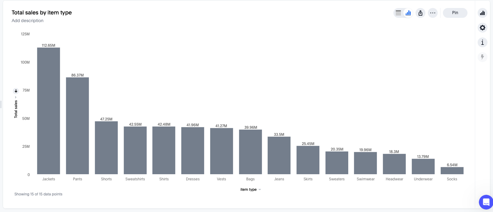

# ThoughtSpot Tutorial

## Create a new Liveboard 

Click the Liveboards tab, and then select the `+ Liveboard` button to create a new Liveboard

Click on the Home tab

Then in the search, select the `(Sample) Retail - Apparel `data

From the drop down select the dataset 

**NOTE: DO NOT WORRY ABOUT MATCHING THE VIZ COLORS IN THE SCREEN SHOTS**

In the search type `sales by item type` which will produce your visualization 

Click on the table view to inspect the data

Click on the **Edit** button 

Then click on settings 

Sort the chart by Descending order by Sales

The Regression line has no meaning, go edit the chart and remove the regression line

Notice the search query has changed based on the sort

To save your visualization click the **Pin** button to pin it to your liveboard 

You can click the **View Liveboard** which will take you to your page

Let’s add another visualization. You can click home to the main search menu and type

`quantity purchased by product 2021 top 10`

Clcik **Edit**

Change the Chart type

Then Pin the final visualization to your Liveboard 

You can click the **View Liveboard**

We will add few more visualizations. I will show you the queries and you will modify the visualization 

**Query** `sales item type 2021`

View 

**Query** `sales store 2021 top 10`

**Query** : `sales by state 2021`

Edit the **Total quantity purchased by product** to include labels as shown

This is my final Liveboard view

Click the Edit icon 

You will add a new tab and move some of the visuals there 

Click +Add tab and call it `Performance` and then add another tab and call it `Overview`

In the Map visual click 

Then select Move to tab, and select Overview. 

Do the same for the Pie Chart visual.

When done click **Save** on the top right corner.

Create two more visuals using the following Queries: `total sales in 2021` and `total quantity purchased in 2021` these will create KPI visual. Add each one to your Liveboard 

Move the two visuals you just created to the Overview tab

Notice when you click the  in the visual box you get to select the size/shape of the visual as shown 

You can also move the visuals around and adjust their size. 

Make the necessary changes to make both tabs look like the following 

Add a note to the Overview tab

Click Add filter while you are still in Edit mode 

Select Region, then select East, Midwest, and Southwest 

Then click Apply

Noice the the screen now has a global filter 

Update the filter to include only **east** then hit apply. Check the Overview tab and see how the numbers changed as well as the map

Add another filter, this time **date**

Click Fixed tab, and select Between and hit apply. Finally click SAVE to apply all the changes. 

Click the date filter, and select and hit apply. Try different dates. 

Right click on the Pants column from the Total sales by item type, then click Filter

Undo the filter.

Right click Pants again, this time select Drill down option

Select store

Right click New Jersey and click Filter

Once done. Click Clear all from the top left 

---

## Functions

Click **Search data** and select the (Sample) Retail - Apparel dataset

Search `sales by item type`

Switch to table view

In the data panel , click the + Add button, and select **Formula** 

This will show the Formula Editor 

Make the following updates then click Save

The Table will be updated. You can also see the Formulas section with all the formulas listed nuder the data panel 

Update the query `by item type Sales Increase by 20% by month`

Add it to your Liveboard

Run a new query `sales and quantity purchased by store`

Change Total Sales to Average and Total Quantity Purchased to Average 

Create a new formula 

Click number formatting

And make the following changes

Click on Store an add a filter for the specific stores

Click on Chart view

Create a new query `sales by product` and change to table view

Add a formula 

Update the Query 

Create a new formula 

---

## SpotIQ

Try this Query

Click Edit

Then select SpotIQ Analyze

Finally go to the SpotIQ space

Review the output 

